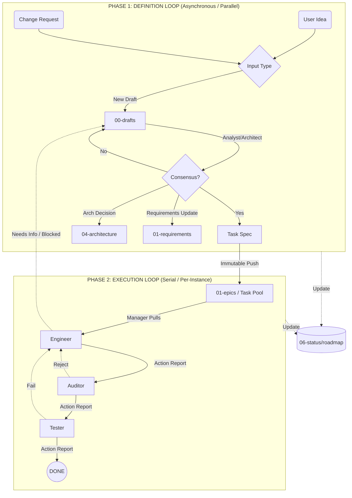

# PROCESS OVERVIEW: THE AGENTIC WORKFLOW

## 1. Core Philosophy: Artifact-Driven Determinism

The `Mandelbrot Explorer` project operates as a deterministic system driven by **Artifacts**. The state of the project is defined solely by the existence and content of specific documents in the file system. Implicit knowledge, verbal agreements, or chat context are invalid for state persistence.

### Fundamental Principles
1.  **Immutability of Tasks:** Once a `Task Definition` is finalized in `01-epics`, it becomes immutable. To change requirements, a formal `Change Request` must be created.
2.  **Decoupled Loops:** The process is split into two asynchronous loops: the **Definition Loop** (Strategy) and the **Execution Loop** (Tactics). They operate independently, connected only by the Task Buffer (`01-epics`).
3.  **Explicit Handovers:** Responsibility is transferred between Agents only via the creation of documents (e.g., `Action Report`, `RFC`, `Idea`).

## 2. Macro Architecture: The Dual-Loop System

The workflow follows a Producer-Consumer model where requirements are continuously refined in Phase 1 and consumed by Phase 2. These loops can run in parallel.

* **Concurrency:** Phase 1 can process multiple Ideas/CRs simultaneously. Phase 2 processes Tasks serially per Engineer instance.
* **Independence:** Execution does not wait for *all* requirements to be defined. As soon as a single Task enters the buffer, execution can begin.

## 3. Phase 1: The Definition Loop

*Goal: Transforming abstract intent into concrete, technically viable Task Definitions.*

This loop operates in a **Quasi-Parallel** mode. The Analyst and Architect can explore multiple features, refactors, or architectural changes simultaneously. This phase is "cheap" and allows for iteration.

* **Trigger Artifacts:**
* `Idea`: A new feature or concept (template-idea.md).
* `Change Request (CR)`: A modification to existing requirements (template-change-request.md).
* `Action Report (Needs Info)`: Feedback from Phase 2.

* **Workspace:** `docs/control/05-tasks/00-drafts/` (RFC Process).
* **Actors:** Analyst (Lead), Architect, User (Operator).
* **Output (The Contract):**
* **Task Definition:** A codified file placed in `01-epics` (template-task-definition.md).
* **ADR:** Architecture Decision Record (if required).
* **Updated Requirements:** Modifications to `01-requirements`.

*See `01-definition-loop.md` for the detailed state machine.*

## 4. Phase 2: The Execution Loop

*Goal: Transforming a Task Definition into verified, high-integrity Code.*

This loop operates in a **Strict Serial** mode (per Developer/Engineer context). It requires focus and strict adherence to safety protocols.

* **Trigger Artifact:** Immutable Task Definition pulled from `01-epics`.
* **Workspace:** Source code `src/` and `docs/control/05-tasks/02-reports/`.
* **Actors:** Manager (Scheduler), Engineer, Auditor, Tester.
* **Key Mechanism:** **Action Report (AR)**. Every transition (e.g., Code -> Audit) requires an AR to be generated using `template-action-report.md`.

*See `02-execution-loop.md` for the detailed state machine.*

## 5. Global State Management

The **Manager** acts as the System Kernel. It observes artifacts generated by both loops and updates the single source of truth.

**Source of Truth:** `docs/control/06-status/00-roadmap-status.md`

### Task Lifecycle States

1. **`DRAFTING`** (Phase 1): Under discussion in `00-drafts`.
2. **`PENDING`** (Buffer): Defined, sitting in `01-epics`, waiting for assignment.
3. **`ACTIVE`** (Phase 2): Assigned to an Engineer. Work in progress.
4. **`AUDIT`** (Phase 2): Code submitted via AR. Waiting for Auditor compliance check.
5. **`VALIDATION`** (Phase 2): Audit passed via AR. Waiting for Tester runtime verification.
6. **`DONE`** (Archived): Task completed and verified.
7. **`BLOCKED`** (Exception): Execution halted due to missing dependencies or information.

## 6. Safety Protocols (Anti-Freeze)

To prevent process deadlocks in this asynchronous environment:

1. **The "Needs Info" Escalation:**
If an Engineer in Phase 2 reports `Outcome: NEEDS_INFO` via an AR, the Task is pushed back to Phase 1 (`DRAFTING`). The Engineer picks up the next `PENDING` task immediately. Execution does not stop.
2. **The "Audit First" Rule:**
Code is never tested dynamically (`VALIDATION`) before it passes static analysis (`AUDIT`). This protects the hardware and the stability of the build.
3. **The "Buffer Monitoring" Rule:**
The Manager must constantly monitor `01-epics`. If the buffer is empty, the Manager signals the Analyst (Phase 1) to prioritize drafting. If the buffer is full but `ACTIVE` is empty, the Manager signals the Engineer (Phase 2) to pull a task.
