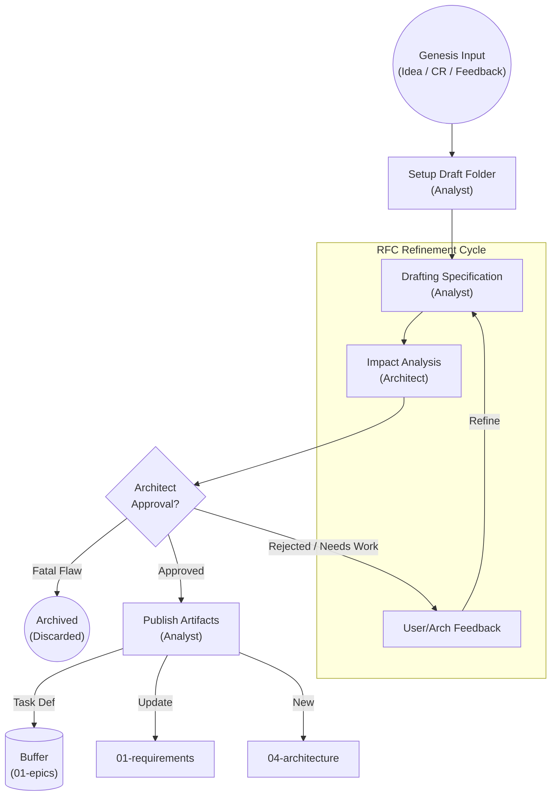

<!--
  Mandelbrot Explorer
  Copyright (C) 2026 Marcin Kaim

  This program is free software: you can redistribute it and/or modify
  it under the terms of the GNU General Public License as published by
  the Free Software Foundation, either version 3 of the License, or
  (at your option) any later version.

  This program is distributed in the hope that it will be useful,
  but WITHOUT ANY WARRANTY; without even the implied warranty of
  MERCHANTABILITY or FITNESS FOR A PARTICULAR PURPOSE.  See the
  GNU General Public License for more details.

  You should have received a copy of the GNU General Public License
  along with this program.  If not, see <https://www.gnu.org/licenses/>.
-->

# PROCESS DEFINITION: PHASE 1 - THE DEFINITION LOOP

## 1. Objective & Philosophy
**"Measure twice, cut once."**

The Definition Loop is the **Strategy Engine** of the project. Its purpose is to transform abstract intent (Ideas, Change Requests) into concrete, immutable Task Definitions that can be safely executed by Engineers.

* **Low Cost:** Changing a text file in `00-drafts` costs nothing.
* **High Iteration:** Ideas can and should be challenged, refined, or discarded here.
* **Safety:** No task enters the Execution Buffer (`01-epics`) without Architecture Approval.

## 2. Actors & Responsibilities

| Role | Responsibility in Phase 1 |
| :--- | :--- |
| **User / Operator** | Provides the **Genesis Artifacts** (Ideas, CRs). Validates if the drafted spec matches their vision. |
| **Analyst** | **Process Owner.** Facilitates the RFC discussion, converts abstract thoughts into structured Markdown (`Task Definition`), maintains `01-requirements`. |
| **Architect** | **Gatekeeper.** Performs Impact Analysis. Ensures the new spec does not violate ADRs or Safety Standards. Rejects dangerous ideas. |
| **Manager** | **Observer.** Monitors the `01-epics` buffer level. If low, signals Analyst to prioritize this loop. |

## 3. The Workspace Structure

Phase 1 operates entirely within: `docs/control/05-tasks/00-drafts/`.

Each potential unit of work gets its own **Draft Folder**:
* Format: `DRAFT-[YYYYMMDD]-[Topic]/`
* Example: `docs/control/05-tasks/00-drafts/DRAFT-20250115-3d-mouse/`

Inside this folder, the history of the discussion is preserved via **RFC Files** (`01-proposal.md`, `02-critique.md`, `03-final-spec.md`).

## 4. The Workflow State Machine

The Definition Loop follows a strict validation cycle.

## 5. Process Steps Details

### Step 1: Genesis (Input)

The loop is triggered by the creation of a **Genesis Artifact**.

* **New Feature:** User creates `template-idea.md`.
* **Requirement Change:** User/Agent creates `template-change-request.md`.
* **Escalation:** Engineer (Phase 2) reports `NEEDS_INFO`. Analyst creates a Draft to resolve the ambiguity.

### Step 2: Setup (Analyst)

The Analyst acknowledges the input:

1. Creates a folder: `00-drafts/DRAFT-{ID}-{Name}`.
2. Moves the Genesis Artifact into this folder as `00-genesis.md`.
3. Initializes `01-proposal-rfc.md` (Initial attempt at specifying the solution).

### Step 3: The RFC Cycle (Refinement)

This is an iterative conversation recorded in documents.

1. **Drafting:** Analyst writes the `Task Definition` (draft version) inside the folder.
2. **Critique:** Architect reviews the draft against `01-requirements` and `04-architecture`.
* *Question:* "Does this require a new ADR?"
* *Question:* "Does this violate SPARK safety?"

3. **Consensus:** The User confirms "Yes, this is what I want."

### Step 4: Approval & Impact Analysis (Architect)

Before leaving Phase 1, the Architect performs the final **Impact Analysis**.

* If the change modifies `REQ-002`, does it break `Task-1.5` (already done)?
* If yes, the Analyst must create a **Regression Task** or update the scope.
* **Outcome:** `APPROVED` or `REJECTED`.

### Step 5: Publication (The Commit)

Once Approved, the Analyst performs the **Atomic Commit**:

1. **Create Task:** Copy the final spec to `docs/control/05-tasks/01-epics/`. **(It is now Immutable)**.
2. **Update Requirements:** Modify `docs/control/01-requirements/` if necessary.
3. **Create ADR:** If the discussion produced an architectural decision, create `docs/control/04-architecture/ADR-XXX.md`.
4. **Cleanup:** Move the `DRAFT-...` folder to an archive location (or delete, depending on retention policy).
5. **Notify:** Update `06-status/roadmap` (Task status: `PENDING`).

## 6. Handling "Needs Info" (Feedback Loop)

If an Engineer in Phase 2 gets blocked and returns a task with `NEEDS_INFO`:

1. This acts as a **Critical Priority** trigger for Phase 1.
2. Analyst locates the original Draft or creates a new `DRAFT-HOTFIX-...`.
3. The ambiguity is resolved via the RFC cycle.
4. The Task Definition in `01-epics` is **NOT** edited. A **Addendum** or a **New Task** is created to supplement the original instruction.
