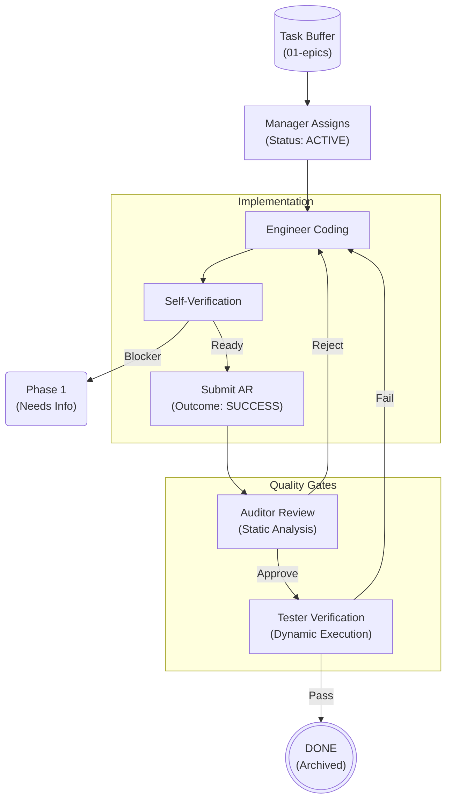

<!--
  Mandelbrot Explorer
  Copyright (C) 2026 Marcin Kaim

  This program is free software: you can redistribute it and/or modify
  it under the terms of the GNU General Public License as published by
  the Free Software Foundation, either version 3 of the License, or
  (at your option) any later version.

  This program is distributed in the hope that it will be useful,
  but WITHOUT ANY WARRANTY; without even the implied warranty of
  MERCHANTABILITY or FITNESS FOR A PARTICULAR PURPOSE.  See the
  GNU General Public License for more details.

  You should have received a copy of the GNU General Public License
  along with this program.  If not, see <https://www.gnu.org/licenses/>.
-->

# PROCESS DEFINITION: PHASE 2 - THE EXECUTION LOOP

## 1. Objective & Philosophy
**"Trust, but Verify."**

The Execution Loop is the **Production Engine** of the project. Its sole purpose is to transform an immutable `Task Definition` into verified, high-integrity artifacts (Code, Tests, Documentation).

* **Strict Serialization:** A task moves through a linear pipeline: Implement -> Audit -> Validate.
* **Audit First:** We never test code that hasn't passed static analysis. Bad architecture that "works" is rejected.
* **Artifact Driven:** State transitions occur ONLY when an **Action Report (AR)** is committed.

## 2. Actors & Responsibilities

| Role | Responsibility in Phase 2 |
| :--- | :--- |
| **Manager** | **Scheduler.** Monitors the `01-epics` buffer. Assigns `PENDING` tasks to Engineers. Updates global status based on ARs. |
| **Engineer** | **Builder.** Writes code and unit tests. Must verify requirements locally before submitting an AR. |
| **Auditor** | **Static Gatekeeper.** Reviews code against ADRs, Safety Standards (SPARK), and Clean Code principles. |
| **Tester** | **Dynamic Gatekeeper.** Executes the build in the container. Runs integration tests. Verifies "Definition of Done". |

## 3. The Workspace Structure

Phase 2 operates across the entire repository, but interactions are logged here:

* **Input Buffer:** `docs/control/05-tasks/01-epics/` (Read-Only for Engineer).
* **Output Logs:** `docs/control/05-tasks/02-reports/{task-id}/`.
    * Every action generates a report here: `AR-{Order}-{Role}-{Outcome}.md`.

## 4. The Workflow State Machine

## 5. Process Steps Details

### Step 1: Assignment (Manager)

* **Trigger:** Buffer `01-epics` contains tasks. Engineer is idle.
* **Action:** Manager selects the highest priority task.
* **Update:** Changes status in `roadmap` to `ACTIVE`.
* **Signal:** Notifies Engineer to begin `task-X.Y`.

### Step 2: Implementation (Engineer)

* **Context Loading:** Engineer reads `Task Definition`, `REQ-*`, and `ADR-*`.
* **Work:** Modifies `src/`, creates `tests/`.
* **Self-Correction:** Runs local build (`make build`).
* **Submission:**
    1. Creates folder: `docs/control/05-tasks/02-reports/task-X.Y/`.
    2. Generates Report: `AR-01-engineer-success.md` using `template-action-report.md`.
* **Outcome:** `SUCCESS` (moves to Audit) or `NEEDS_INFO` (escalates to Phase 1).

### Step 3: Static Audit (Auditor)

* **Trigger:** Appearance of Engineer's AR with `SUCCESS`.
* **Action:** Review code changes (Diff).
    * Check 1: Does it violate `ADR-005` (Architecture)?
    * Check 2: Are there forbidden types (e.g., `Unchecked_Conversion` without justification)?
    * Check 3: Is the code readable?
* **Submission:**
    * Generates `AR-02-auditor-outcome.md`.
* **Outcome:** `SUCCESS` (moves to Testing) or `FAILURE` (back to Engineer).

### Step 4: Dynamic Validation (Tester)

* **Trigger:** Appearance of Auditor's AR with `SUCCESS`.
* **Action:**
    * Runs `make test` inside the container.
    * Verifies `Definition of Done` (e.g., "App runs for 10 minutes without leak").
    * Checks edge cases not covered by Unit Tests.
* **Submission:**
    * Generates `AR-03-tester-outcome.md`.
* **Outcome:** `SUCCESS` (moves to Done) or `FAILURE` (back to Engineer).

### Step 5: Closure (Manager)

* **Trigger:** Appearance of Tester's AR with `SUCCESS`.
* **Action:**
    1. Updates `00-roadmap-status.md` to `DONE`.
    2. (Optional) Moves Task file to `completed_tasks` (if using archive folder structure).
    3. Signals availability of resources for the next task.

## 6. The "Action Report" Protocol

The **Action Report (AR)** is the mandatory token for state transition.

* **Format:** Markdown based on `template-action-report.md`.
* **Naming:** `AR-{Sequence}-{Role}-{Outcome}.md`.
* **Mandatory Fields:**
    * `Relates To`: Maintains the chain of custody (linkage to previous state).
    * `Process & Reasoning`: Explains the logic behind the changes.
* **Content:** Must include a list of modified files, evidence of verification, and decision justification.

## 7. Exception Handling

### Scenario A: Ambiguous Requirements

* **Who:** Engineer.
* **Action:** Submit AR with Outcome `NEEDS_INFO`.
* **Result:** Manager changes status to `DRAFTING`. Analyst (Phase 1) is notified. Task is removed from the Engineer's queue until resolved.

### Scenario B: Audit Rejection

* **Who:** Auditor.
* **Action:** Submit AR with Outcome `FAILURE` + List of specific violations.
* **Result:** Status remains `ACTIVE`. Engineer must produce a "Fix" commit and a new AR (e.g., `AR-03-engineer-fix.md`).

### Scenario C: Technical Blockage

* **Who:** Engineer.
* **Action:** Submit AR with Outcome `BLOCKED`.
* **Result:** Manager intervenes. May require a new `00-scaffolding` task or help from DevOps.
