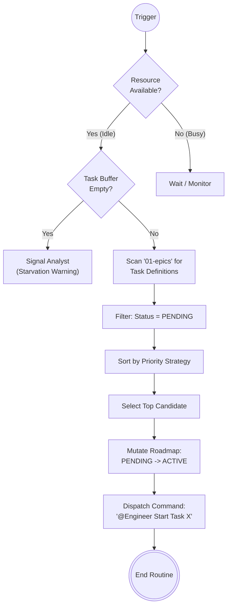

# Scenario: ROUTINE_TASK_SCHEDULING

## 1. Objective

**Maximize System Throughput.**

The goal of this routine is to ensure that the Execution Loop resources (specifically the **Engineer**) are never idle while valid work units exist in the Task Buffer. The Manager acts here as a non-preemptive scheduler.

## 2. Process Flow Diagram

## 3. Triggers & Pre-conditions

This routine is invoked in the following situations:

1. **Cold Start:** Project initialization or session start.
2. **Resource Release:** An Engineer has just completed a task (Status transitioned to `AUDIT` or `BLOCKED`, freeing up the coding capability).
3. **Buffer Injection:** The Analyst has committed a new Task Definition to `01-epics`.

## 4. Input Data (Read-Only)

* **Global State:** `docs/control/06-status/00-roadmap-status.md` (To check current resource allocation and task statuses).
* **Task Buffer:** `docs/control/05-tasks/01-epics/` (To read Task Definition Metadata, specifically `Priority` and `Type`).

## 5. Execution Algorithm

### Step 1: Resource Availability Check

* **Action:** Verify if the **Engineer** agent is currently assigned to an `ACTIVE` task.
* **Logic:**
    * IF `Roadmap` contains any task with Status `ACTIVE` assigned to Engineer X: -> **ABORT** (Resource Busy).
    * IF Engineer X has no `ACTIVE` tasks: -> **PROCEED**.

### Step 2: Buffer Scanning & Filtering

* **Action:** List all `.md` files in `docs/control/05-tasks/01-epics/` (recursively).
* **Filter:** Cross-reference with `00-roadmap-status.md`. Retain ONLY tasks where `Status == PENDING`.

### Step 3: Prioritization Strategy (The Sorting Hat)

Sort the filtered list based on the following hierarchy (highest to lowest):

1. **Tier 1: HOTFIX / MAINTENANCE**
    * *Identifier:* Tasks located in `99-maintenance` OR file name starts with `bug-` / `hotfix-`.
    * *Reason:* System stability takes precedence over new features.

2. **Tier 2: CRITICAL PRIORITY**
    * *Identifier:* Metadata `Priority: Critical` inside the Task Definition file.
    * *Reason:* Defined by Analyst as urgent.

3. **Tier 3: BLOCKERS**
    * *Identifier:* Task is listed as a dependency for other PENDING tasks (if dependency graph is explicit).
    * *Reason:* Unblocks future throughput.

4. **Tier 4: STANDARD (FIFO)**
    * *Identifier:* Oldest file modification date (or lowest alphanumeric ID).
    * *Reason:* Fairness.

### Step 4: Atomic Assignment

* **Selection:** Pick the top task from the sorted list (Let's call it `TARGET_TASK`).
* **State Mutation (Crucial):**
    1. Open `docs/control/06-status/00-roadmap-status.md`.
    2. Locate the entry for `TARGET_TASK`.
    3. Change Status column from `PENDING` to `ACTIVE`.
    4. Assign Owner column to `Engineer`.
    5. Save file.

### Step 5: Dispatch

* **Action:** Issue a clear, directive prompt to the Engineer.
* **Template:**
    > "@Engineer, I have assigned you task `[Task ID]`. Status is now **ACTIVE**.
    > Please read the definition in `[Path to Task]` and begin the implementation loop.
    > Report back with an **Action Report (AR)** upon completion."

## 6. Exception Handling

### Case A: Starvation (Empty Buffer)

* **Condition:** Resource is IDLE, but no PENDING tasks exist.
* **Action:** Issue a warning to the **Analyst**.
    > "@Analyst, the Execution Loop is starving. The Engineer is idle. Please prioritize the Definition Loop."

### Case B: Roadmap Desynchronization

* **Condition:** A task file exists in `01-epics` but is missing from `00-roadmap-status.md`.
* **Action:** Automatically append the task to the Roadmap with status `PENDING` and immediately restart the Scheduling Routine.
