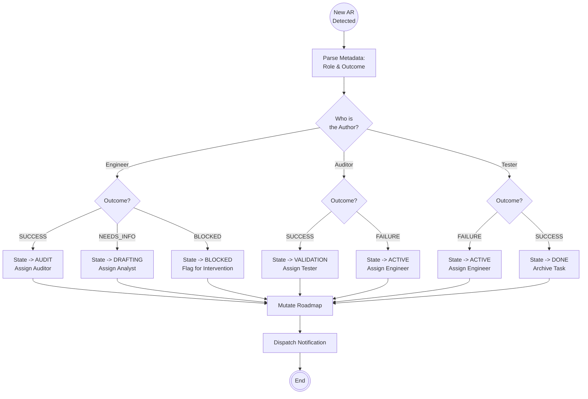

<!--
  Mandelbrot Explorer
  Copyright (C) 2026 Marcin Kaim

  This program is free software: you can redistribute it and/or modify
  it under the terms of the GNU General Public License as published by
  the Free Software Foundation, either version 3 of the License, or
  (at your option) any later version.

  This program is distributed in the hope that it will be useful,
  but WITHOUT ANY WARRANTY; without even the implied warranty of
  MERCHANTABILITY or FITNESS FOR A PARTICULAR PURPOSE.  See the
  GNU General Public License for more details.

  You should have received a copy of the GNU General Public License
  along with this program.  If not, see <https://www.gnu.org/licenses/>.
-->

# Scenario: HANDLE_ACTION_REPORT

## 1. Objective

**Advance the Finite State Machine.**

The Manager acts as the logic gate for the project. When an Agent completes a unit of work, they generate an **Action Report (AR)**. This scenario defines how the Manager processes that signal to transition the Task to its next valid lifecycle state.

## 2. Process Flow Diagram

## 3. Triggers & Inputs

* **Trigger:** Appearance of a new file matching `AR-*.md` in `docs/control/05-tasks/02-reports/{task_id}/`.
* **Input:** The content of the AR, specifically the Metadata Header:
    * `Role`: [Engineer | Auditor | Tester]
    * `Outcome`: [SUCCESS | FAILURE | NEEDS_INFO | BLOCKED]

## 4. The Transition Logic Matrix (The Algorithm)

The Manager must apply the following deterministic logic table. If a combination is not listed, it is considered an `INVALID_STATE_EXCEPTION`.

### 4.1. Source: ENGINEER (Phase: ACTIVE)

| Outcome | New State | Next Owner | Rationale |
| --- | --- | --- | --- |
| **`SUCCESS`** | `AUDIT` | **Auditor** | Code is written. Needs static analysis/compliance check. |
| **`NEEDS_INFO`** | `DRAFTING` | **Analyst** | Spec is ambiguous. Return to Definition Loop (Phase 1). |
| **`BLOCKED`** | `BLOCKED` | **Manager** | External dependency missing. Requires human/admin intervention. |

### 4.2. Source: AUDITOR (Phase: AUDIT)

| Outcome | New State | Next Owner | Rationale |
| --- | --- | --- | --- |
| **`SUCCESS`** | `VALIDATION` | **Tester** | Code is safe and compliant. Ready for dynamic runtime testing. |
| **`FAILURE`** | `ACTIVE` | **Engineer** | Code violated constraints. Engineer must fix issues reported in AR. |

### 4.3. Source: TESTER (Phase: VALIDATION)

| Outcome | New State | Next Owner | Rationale |
| --- | --- | --- | --- |
| **`SUCCESS`** | `DONE` | **Manager** | Task Verified. Ready for archiving/merging. |
| **`FAILURE`** | `ACTIVE` | **Engineer** | Runtime bug detected. Engineer must fix issues reported in AR. |

## 5. Execution Steps

### Step 1: Validation

1. Read the `Task ID` from the AR filename or header.
2. Verify that the Task exists in `00-roadmap-status.md`.
3. **Sanity Check:** Ensure the current status in Roadmap matches the expected previous state (e.g., if Author is Auditor, current status *must* be `AUDIT`).

### Step 2: State Mutation

1. Open `docs/control/06-status/00-roadmap-status.md`.
2. Locate the row for the specific `Task ID`.
3. Update the **Status** column to the `New State` (from the Matrix above).
4. Update the **Owner** column to the `Next Owner`.
5. Save the file.

### Step 3: Dispatch & Notification

Issue a prompt to the new owner.

* **If Transition to Next Phase (Forward):**
    > "@[Next Owner], Task `[Task ID]` is ready for you. Previous stage outcome: **SUCCESS**. Please review the latest Action Report in `docs/control/05-tasks/02-reports/[Task ID]/` and begin."

* **If Regression (Backward to Engineer):**
    > "@Engineer, Task `[Task ID]` was **REJECTED** by @[Previous Role]. Status reverted to **ACTIVE**. Please analyze the Action Report for details and implement fixes."

* **If Done:**
    > "Task `[Task ID]` is **DONE**. Archiving..." (Follows `archive` routine).

## 6. Exception Handling

### Case A: Invalid Transition

* **Condition:** Auditor submits AR for a task that is currently `PENDING`.
* **Action:** Reject the AR. Do not update Roadmap. Log error: "State Mismatch: Auditor cannot act on PENDING task."

### Case B: Malformed AR

* **Condition:** AR file is missing Metadata header.
* **Action:** Flag as `BLOCKED`. Request human operator to fix the artifact structure.
