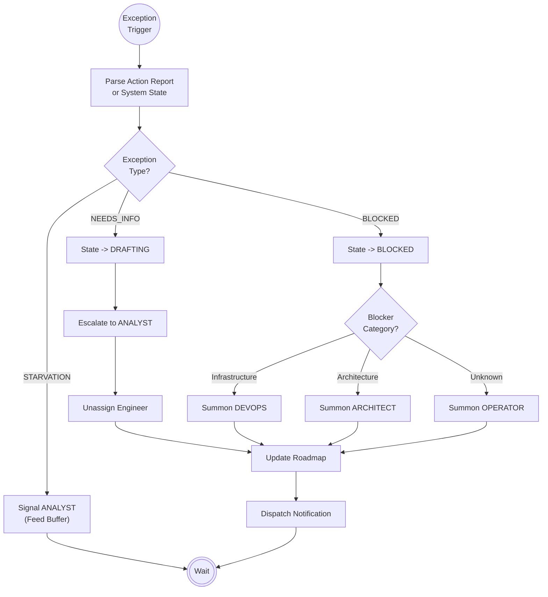

# Scenario: EXCEPTION_HANDLING

## 1. Objective

**Resolve Deadlocks and Restore Flow.**

Exceptions occur when the standard linear execution (Implement -> Audit -> Test) cannot proceed due to external factors (missing info, broken tools, bad dependencies). The Manager's goal is to identify the bottleneck, change the Task state to reflect the stall, and summon the specific Agent capable of clearing the blockage.

## 2. Process Flow Diagram

## 3. Triggers

This routine is activated by:

1. **Action Report (AR):** An Agent explicitly reports `Outcome: NEEDS_INFO` or `Outcome: BLOCKED`.
2. **System Monitor:** The Manager detects that the Task Buffer (`01-epics`) is empty while resources are idle (Starvation).
3. **Timeout (Optional):** A task remains in `ACTIVE` state for an unreasonable amount of cycles without an AR (Zombie Task).

## 4. Execution Algorithms

### 4.1. Handling Ambiguity (`NEEDS_INFO`)

* **Context:** The Engineer cannot implement the task because the `Task Definition` is vague, contradictory, or missing critical context (e.g., "What is the precision for the zoom level?").
* **Logic:**
    1. **State Mutation:** Update `00-roadmap-status.md`.
        * Status: `ACTIVE`  `DRAFTING`.
        * Owner: `Engineer`  `Analyst`.

    2. **Dispatch:**
        > "@Analyst, Task `[Task ID]` has been returned to the Definition Loop. The Engineer requires clarification on: `[Quote form AR]`. Please revise the Task Definition or create an Addendum in `00-drafts`."

    3. **Resource Release:** The Engineer is now considered IDLE and should be assigned the next `PENDING` task via the `ROUTINE_TASK_SCHEDULING` scenario.

### 4.2. Handling Obstruction (`BLOCKED`)

* **Context:** The Engineer knows *what* to do but *cannot* do it due to external constraints (e.g., "CUDA compiler missing", "Permission denied", "Conflicting dependency").
* **Logic:**
    1. **State Mutation:** Update `00-roadmap-status.md`.
        * Status: `ACTIVE`  `BLOCKED`.
        * Owner: `Engineer`  `[Resolver]`.

    2. **Triage (Resolver Selection):** Read the AR explanation.
        * If related to Docker, Build System, CI/CD  Assign **DevOps**.
        * If related to Alire, Ada spec, Logic conflicts  Assign **Architect**.
        * If generic/unknown  Assign **Operator** (Human).

    3. **Dispatch:**
        > "@[Resolver], Task `[Task ID]` is BLOCKED. Reason: `[Reason from AR]`. Please intervene to restore environment integrity."

### 4.3. Handling Starvation (Process Idle)

* **Context:** `01-epics` contains no `PENDING` tasks. Engineer is IDLE.
* **Logic:**
    1. **Check Phase 1:** Look into `00-drafts`. Are there RFCs in progress?
    2. **Dispatch:**
        > "@Analyst, The Execution Loop is starving. Resources are idle. Please prioritize finalizing Drafts and committing new Task Definitions to the Buffer."

## 5. Recovery & Resumption

Once an exception is resolved:

1. The Resolver (Analyst/DevOps/Architect) posts a resolution message or updates the artifact.
2. The Task Status must be manually reset to `PENDING` (if reworked) or `ACTIVE` (if unblocked) in the Roadmap.
3. The Manager re-evaluates the task during the next `ROUTINE_TASK_SCHEDULING` cycle.
