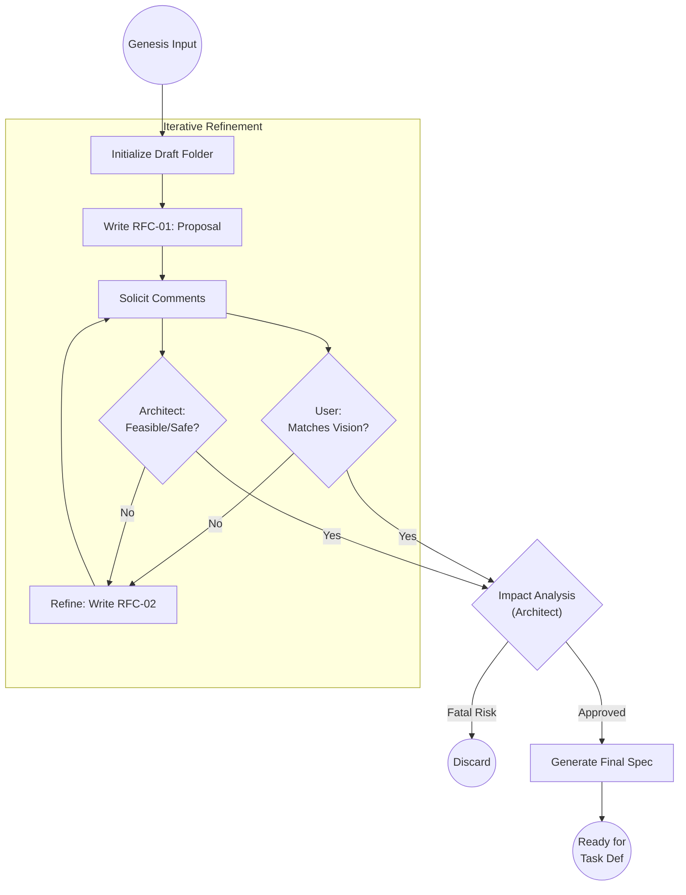

# Scenario: THE_RFC_PROCESS

## 1. Objective

**Achieve Technical Consensus.**

This scenario describes the iterative process of transforming a raw input (Idea, Change Request, or Ambiguity) into a mature, approved specification. The goal is to eliminate risk and ambiguity *before* any code is written.

## 2. Process Flow Diagram

## 3. Triggers

This routine is initiated by:

1. **User Idea:** A new file in `00-drafts/` based on `template-idea.md`.
2. **Change Request:** A new file based on `template-change-request.md`.
3. **Needs Info:** An escalation from the Execution Loop (Engineer blocked by ambiguity).

## 4. Input Data

* **Genesis Artifact:** The source file describing the intent.
* **Context:** `01-requirements/` (To check against project vision) and `04-architecture/` (To check against constraints).

## 5. Execution Algorithm

### Step 1: Initialization (The Draft Space)

* **Action:** The Analyst establishes a dedicated workspace for the discussion.
* **Mechanism:**
    1. Create a directory: `docs/control/05-tasks/00-drafts/DRAFT-[YYYYMMDD]-[Topic]/`.
    2. Move the Genesis Artifact (Idea/CR) into this folder.
    3. Create an index file or `README.md` if the topic is complex.

### Step 2: The Proposal (RFC-01)

* **Action:** The Analyst translates the Genesis Artifact into a technical proposal.
* **Mechanism:** Create `RFC-01-proposal.md` using `template-request-for-comment.md`.
* **Content:**
    * **Context:** "User wants X."
    * **Proposed Solution:** "We will implement X using pattern Y."
    * **Open Questions:** "How does this affect memory usage?"

### Step 3: The Critique Loop (Adversarial Refinement)

* **Action:** The Analyst acts as a moderator, synthesizing feedback from two key stakeholders:
    1. **The User (Vision):** "Is this what you meant?"
    2. **The Architect (Feasibility):** "Does this break SPARK safety? Does it fit the CUDA model?"

* **Mechanism:**
    * If feedback is critical, the Analyst creates `RFC-02-refinement.md` incorporating the changes.
    * This cycle repeats until both stakeholders answer "YES".

### Step 4: Impact Analysis (The Safety Gate)

* **Action:** Before finalizing, the Analyst explicitly requests an **Impact Analysis** from the Architect.
* **Checks:**
    * Does this require updating `01-requirements`?
    * Does this require a new **ADR** in `04-architecture`?
    * Does this invalidate any existing `DONE` tasks?

* **Outcome:**
    * **APPROVED:** Proceed to Finalization.
    * **REJECTED:** The idea is technically sound but too costly/risky. Archive the Draft.

### Step 5: Finalization

* **Action:** The Analyst synthesizes the entire RFC chain into a single, clean specification document.
* **Output:** A draft `Task Definition` file inside the Draft folder, ready for the `TASK_DEFINITION` scenario.

## 6. Artifact Standards

* **RFC Naming:** `RFC-[Sequence]-[Topic].md` (e.g., `RFC-01-initial-proposal.md`).
* **Immutability:** Once an RFC file is written and commented on, it should ideally remain unchanged. New thoughts go into a new RFC file (Append-only philosophy) to preserve the decision history.

## 7. Exception Handling

* **Stalemate:** If User and Architect cannot agree (e.g., User wants a feature that Architect deems unsafe), the Analyst must escalate to the **Project Owner** (User) to make a binary decision: "Accept Risk" or "Drop Feature".
