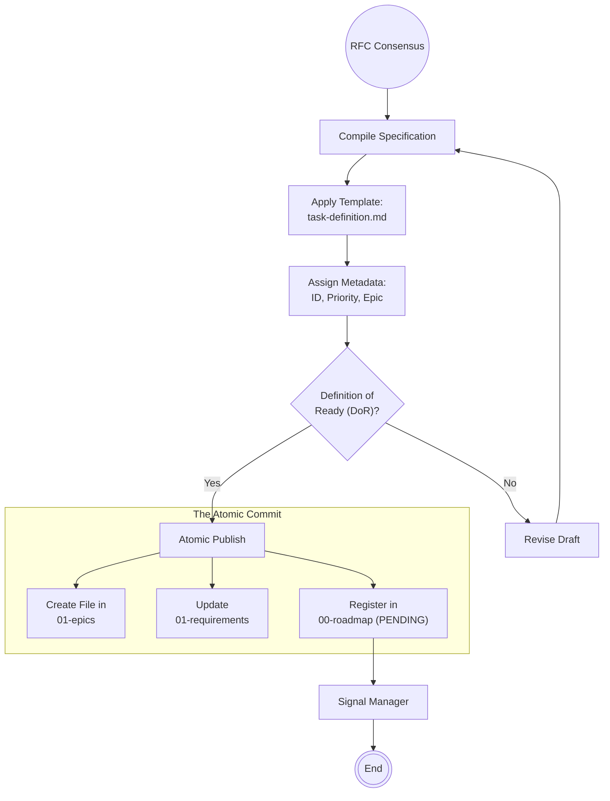

# Scenario: TASK_DEFINITION

## 1. 

**Publish the Execution Contract.**

The objective of this scenario is to formalize the consensus reached during the RFC Process into a strict, machine-readable **Task Definition**. This artifact serves as the immutable input for the Execution Loop (Phase 2). Once a task is published here, it cannot be debated—only executed or cancelled.

## 2. Process Flow Diagram

## 3. Triggers

This routine is invoked when:

1. **RFC Approval:** An Architect explicitly approves a proposal in `00-drafts`.
2. **Hotfix Request:** A critical bug report requires immediate conversion into a formal task without a lengthy RFC cycle.
3. **Routine Maintenance:** Standard housekeeping tasks (e.g., "Upgrade dependency X") defined by the DevOps role.

## 4. Input Data

* **Source Material:** The finalized content from the Draft folder (`RFC-final-spec.md`).
* **Standards:** `template-task-definition.md` (Structure) and `01-requirements/` (Traceability).

## 5. Execution Algorithm

### Step 1: Standardization (Templating)

* **Action:** The Analyst transfers the logic from the Draft into the strict `template-task-definition.md` structure.
* **Logic:**
    * **Context Injection:** The Analyst *must* populate the "Required Reading" section with specific paths (e.g., `docs/control/04-architecture/ADR-005.md`). The Engineer should not have to search for context.
    * **Objective:** Condense the "Why" into a single sentence.
    * **Steps:** Convert narrative text into numbered, verifiable steps.

### Step 2: Metadata Assignment

* **Action:** Assign unique identifiers and routing tags.
* **Naming Convention:** `task-[EpicID].[SeqID]-[kebab-case-name].md`.
    * *Example:* `task-1.2-cuda-memory-manager.md`.

* **Priority:** Set based on RFC conclusion (`Critical`, `High`, `Medium`).

### Step 3: The Quality Gate (Definition of Ready)

Before publishing, the Analyst validates the artifact against the **DoR**:

1. **Atomic:** Can this be finished in one work cycle? (If not, split it).
2. **Clear:** Are there any "TBD" (To Be Determined) markers? (If yes, Reject).
3. **Safe:** Does it reference the correct ADRs?
4. **Testable:** Is the "Definition of Done" specific (e.g., "Passes test X")?

### Step 4: The Atomic Commit (Publication)

This is a multi-file transaction that establishes the task in the system.

1. **Create Task:** Write the file to the appropriate subdirectory in `docs/control/05-tasks/01-epics/`.
2. **Traceability:** If the task fulfills a Requirement, edit the corresponding `REQ-XXX.md` file to link to this new Task ID (Bidirectional linking).
3. **Registration:** Append the task to `docs/control/06-status/00-roadmap-status.md` with status **`PENDING`**.
    * *Note:* The Analyst sets it to `PENDING`. The Manager will later flip it to `ACTIVE`.

### Step 5: Draft Cleanup

* **Action:** Move the source Draft folder from `00-drafts/` to an archive location (or mark as processed) to prevent confusion.

## 6. Output Artifacts

* **Primary:** A read-only Markdown file in `01-epics`.
* **Secondary:** An updated entry in the Roadmap.

## 7. Exception Handling

* **Collision:** If a `task-ID` already exists, the Analyst increments the sequence number.
* **Scope Creep:** If the task definition grows too large during templating, the Analyst triggers a "Task Splitting" routine, creating `task-X.Y` and `task-X.Z` instead of one giant file.
