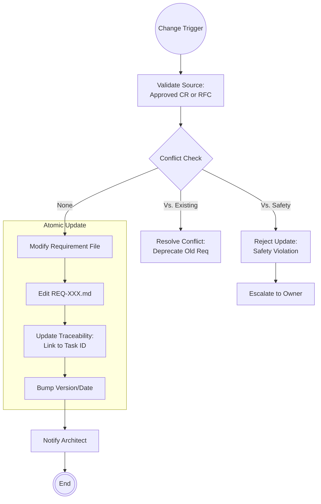

<!--
  Mandelbrot Explorer
  Copyright (C) 2026 Marcin Kaim

  This program is free software: you can redistribute it and/or modify
  it under the terms of the GNU General Public License as published by
  the Free Software Foundation, either version 3 of the License, or
  (at your option) any later version.

  This program is distributed in the hope that it will be useful,
  but WITHOUT ANY WARRANTY; without even the implied warranty of
  MERCHANTABILITY or FITNESS FOR A PARTICULAR PURPOSE.  See the
  GNU General Public License for more details.

  You should have received a copy of the GNU General Public License
  along with this program.  If not, see <https://www.gnu.org/licenses/>.
-->

# Scenario: REQUIREMENTS_MANAGEMENT

## 1. Objective

**Maintain the Source of Truth.**

The objective of this scenario is to manage the lifecycle of the project's "Constitution" stored in `docs/control/01-requirements/`. The Analyst ensures that requirements remain consistent, atomic, and verifiable. Critical to this process is **Traceability**—ensuring that every requirement maps to a Task, and eventually to a Test.

## 2. Process Flow Diagram

## 3. Triggers

This routine is strictly controlled and invoked only by:

1. **Approved Change Request (CR):** A `template-change-request.md` file that has passed the Impact Analysis.
2. **RFC Consensus:** The conclusion of the `THE_RFC_PROCESS` scenario which necessitates a new functional requirement.
3. **Architectural Veto:** The Architect mandates a change to Non-Functional Requirements (e.g., "Must downgrade CUDA version due to driver bug").

## 4. Input Data

* **Target Files:** `REQ-000` (Vision), `REQ-001` (Functional), `REQ-002` (UX), `REQ-003` (Non-Functional/Safety).
* **Change Source:** The accepted CR or RFC document containing the precise wording of the change.

## 5. Execution Algorithm

### Step 1: Conflict Analysis (The Constitution Check)

* **Action:** Before applying any change, the Analyst simulates the impact.
* **Hierarchy Rule:** `REQ-003` (Non-Functional / Safety) overrides `REQ-001` (Functional).
    * *Example:* If a new feature "Infinite Zoom" violates the "Memory Safety" requirement, the Feature is rejected or the implementation method must change.

* **Logic:**
    1. Grep existing files for keywords related to the new requirement.
    2. Identify contradictory statements.
    3. If a conflict exists, creating a `Change Request` to explicitly deprecate the old requirement is mandatory. Implicit overwrites are forbidden.

### Step 2: Atomic Modification

* **Action:** Edit the specific Markdown file.
* **Format:**
    * Do not rewrite the entire document.
    * Add a new item or modify an existing bullet point.
* **Tagging:** Use immutable IDs if possible (e.g., `[REQ-001.5]`), or clear headers.

* **Versioning:** Update the "Last Updated" metadata in the file header.

### Step 3: Enforcing Traceability (The Golden Thread)

* **Action:** Ensure the requirement is linked to the downstream process.
* **Mechanism:**
    * If the requirement triggers a new Task, add a link: `(Implemented by: task-X.Y)`.
    * If the requirement is a constraint, ensure it is referenced in the `Context Injection` section of relevant Task Definitions.
    * *Goal:* A stranger should be able to click from a Requirement -> Task -> Code -> Test.

### Step 4: Notification

* **Action:** Signal the update to key stakeholders.
* **Logic:**
    * If `REQ-003` (Safety/Architecture) changed -> Notify **Architect**.
    * If `REQ-001` (Functional) changed -> Notify **Manager** (may affect Roadmap scope).

## 6. Output Artifacts

* **Updated Files:** Modified markdown files in `docs/control/01-requirements/`.
* **Trace Links:** Bidirectional references between Requirements and Epics/Tasks.

## 7. Exception Handling

### Case A: The "Impossible" Requirement

* **Condition:** A requirement is added (e.g., "Real-time 8K rendering on CPU") that the Architect deems physically impossible *after* it was documented.
* **Action:**
    1. The Analyst creates a "Retraction CR".
    2. The Requirement is not deleted but marked as `~~Strikethrough~~` with a tag `[DEPRECATED: See ADR-XXX]`.
    3. *Rationale:* We preserve the history of failed ideas to avoid repeating them.

### Case B: Scope Creep Detection

* **Condition:** A single Requirement file grows by >20% in one update.
* **Action:** The Analyst splits the requirement into a new file (e.g., `REQ-005-advanced-rendering.md`) to maintain modularity and readability.
