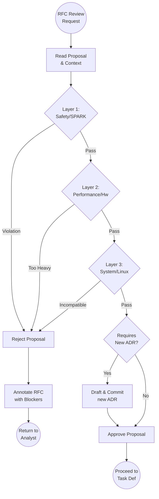

# Scenario: IMPACT_ANALYSIS

## 1. Objective

**Prevent Architecture Erosion.**

The objective of this scenario is to evaluate technical proposals (RFCs) or Change Requests (CRs) against the project's immutable constraints ("First Principles"). The Architect acts as a simulator, projecting the consequences of a proposed change into the future to detect potential conflicts, safety violations, or performance regressions *before* any code is written.

## 2. Process Flow Diagram

## 3. Triggers

This routine is invoked when:

1. **RFC Maturity:** The Analyst tags the Architect in a Draft folder (`00-drafts`) requesting a technical review.
2. **CR Submission:** A formal Change Request is created in `05-tasks/00-drafts/`.
3. **Refactoring Plan:** An Engineer proposes a major structural change via an RFC.

## 4. Input Data

* **The Proposal:** The content of the `RFC-*-proposal.md` or `Change Request`.
* **Hardware Context:** Constraints of the **Lenovo ThinkPad P16 Gen2** (Intel i7-13850HX, 32GB RAM, NVIDIA RTX 3500 Ada).
* **Software Context:** Constraints of **Debian 13 (Trixie)**, **Ada 2022/SPARK**, and **CUDA Driver API**.
* **Legal Code:** Existing **ADRs** in `docs/control/04-architecture/`.

## 5. Execution Algorithm (The Checklist)

The Architect performs a "Deep Tech" inspection across three layers. A failure in any layer triggers an immediate **REJECTION**.

### Layer 1: Safety & Integrity (The Ada/SPARK Layer)

* **Memory Safety:** Does the proposal require `Unchecked_Conversion` or raw pointer arithmetic? If yes, is it absolutely necessary?
* **Verification:** Is the proposed logic compatible with SPARK provers? (e.g., Avoid recursion, avoid dynamic dispatch where possible).
* **Typing:** Does it respect strong typing, or does it rely on "Stringly typed" logic?

### Layer 2: Performance & Resources (The First Principles Layer)

* **Computational Cost:** Estimate the Big-O complexity. Does it hide computational cost behind high-level abstractions?
* **VRAM Budget:** Will the proposed buffer strategy fit within the RTX 3500 Ada limits (approx. 12GB), considering the resolution requirements?
* **Concurrency:** Does the proposal introduce potential race conditions or deadlocks in the CUDA stream handling?

### Layer 3: System Compatibility (The Debian Layer)

* **Dependencies:** Does the proposal introduce libraries not available or stable in Debian 13 (Trixie)?
* **Toolchain:** Is it compatible with the `gnat` / `alire` / `make` ecosystem established in the project?
* **Portability:** Does it rely on non-POSIX calls?

## 6. Decision Logic

### Outcome A: REJECTION (Veto)

* **Action:** The Architect writes a critique in `RFC-XX-critique.md`.
* **Content:** Must be specific.
    * *Bad:* "I don't like this."
    * *Good:* "Rejected. The proposed usage of dynamic allocation inside the render loop violates ADR-005 (Zero-Allocation) and risks VRAM fragmentation on the RTX 3500."

* **Next Step:** Return control to **Analyst** for revision.

### Outcome B: CONDITIONAL APPROVAL (New Law)

* **Condition:** The proposal is good, but introduces a new pattern that must be standardized.
* **Action:** The Architect triggers the `ADR_CREATION` scenario to codify this pattern *before* the task is defined.
* **Next Step:** Create ADR, then Approve.

### Outcome C: APPROVAL (Green Light)

* **Action:** The Architect appends an "Approved" stamp/metadata to the RFC.
* **Next Step:** Signal **Analyst** to proceed with `TASK_DEFINITION`.

## 7. Exception Handling

* **Trade-offs:** If a proposal improves Performance but reduces Safety (or vice versa), the Architect must decide based on `REQ-003` (Non-functional Requirements). If `REQ-003` prioritizes Safety (as standard in SPARK projects), the Performance gain is rejected.
