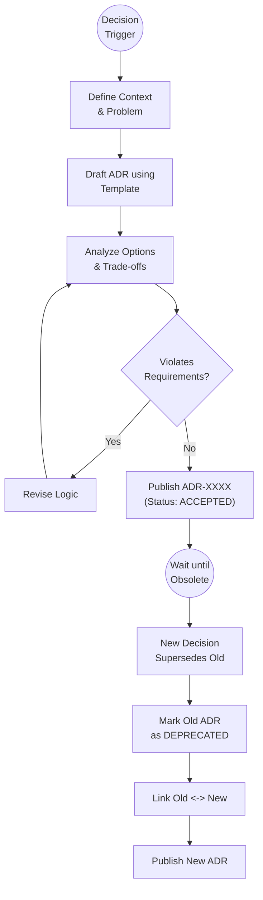

# Scenario: ADR_LIFECYCLE_MANAGEMENT

## 1. Objective

**Codify Technical Wisdom.**

The objective of this scenario is to capture architectural decisions in a structured, immutable format. An **Architecture Decision Record (ADR)** serves as a "Constraint Artifact" that guides future implementation and prevents "Tribal Knowledge" (unwritten rules known only to a few).

## 2. Process Flow Diagram

## 3. Triggers

A new ADR is required when:

1. **RFC Conclusion:** An `IMPACT_ANALYSIS` identifies a significant structural change (e.g., "We will use CUDA Streams for async transfer").
2. **Constraint Definition:** A restrictive rule needs to be enforced globally (e.g., "Banning all dynamic allocation in kernels").
3. **Technology Selection:** A library or tool is officially adopted (e.g., "Adopting `Alire` as package manager").
4. **Correction:** An existing ADR proves to be incorrect or harmful and must be superseded.

## 4. Input Data

* **Problem Statement:** Clear definition of *why* a decision is needed.
* **Context:** Hardware limits (RTX 3500), Software stack (Ada/SPARK), Requirements.
* **Template:** `docs/control/02-workflow/02-document-templates/template-adr.md`.

## 5. Execution Algorithm

### Step 1: Identification & ID Assignment

* **Action:** The Architect reserves the next available sequence number.
* **Format:** `ADR-[SeqID]-[Short-Title].md` (e.g., `ADR-0006-memory-pooling.md`).
* **Sequence:** Monotonically increasing integer (0001, 0002...). Gaps are permitted if a draft is abandoned.

### Step 2: Drafting (The Argument)

* **Action:** Fill the `template-adr.md`.
* **Critical Sections:**
    * **Context:** Describe the tension (e.g., "Safety vs Performance").
    * **Decision:** The specific path chosen.
    * **Consequences:** Both Positive (Benefits) and Negative (Costs). Honesty here is mandatory.
    * **Compliance:** How will the Auditor verify this? (e.g., "Grep for `new` keyword").

### Step 3: Validation

* **Action:** Verify consistency.
* **Check:** Does this ADR contradict `REQ-003` (Safety)? If so, `REQ-003` must be updated first (via Analyst), or the ADR is invalid.

### Step 4: Publication (The Law Enactment)

* **Action:** Commit the file to `docs/control/04-architecture/`.
* **State:** Set status metadata to `ACCEPTED`.
* **Notification:** Signal the **Analyst** (to update future specs) and **Auditor** (to update review checklists).

### Step 5: Amending the Law (Deprecation)

ADRs are never deleted or modified in-place (except for typos). If a decision changes:

1. Create a **New ADR** (e.g., `ADR-0020`).
2. In the New ADR, add header: `Supersedes: ADR-0005`.
3. Edit the **Old ADR** (`ADR-0005`):
    * Change Status to `DEPRECATED` (or `SUPERSEDED`).
    * Add header: `Superseded by: ADR-0020`.
    * Add a strictly visible note explaining *why* it was abandoned.

## 6. Output Artifacts

* **Primary:** A Markdown file in `04-architecture/`.
* **Secondary:** Updates to the "Compliance Checklist" used by the Auditor.

## 7. Exception Handling

### Case A: Emergency Reversal

* **Condition:** An ADR causes a critical production failure.
* **Action:**
    1. Immediately create a "Reversal ADR" (Status: `ACCEPTED`) that explicitly forbids the previous pattern.
    2. Mark the faulty ADR as `REJECTED`.

### Case B: "Provisional" Decisions

* **Condition:** A decision is experimental.
* **Action:** Publish with Status `PROPOSED`. It serves as guidance but not strict law until validated by a prototype.
