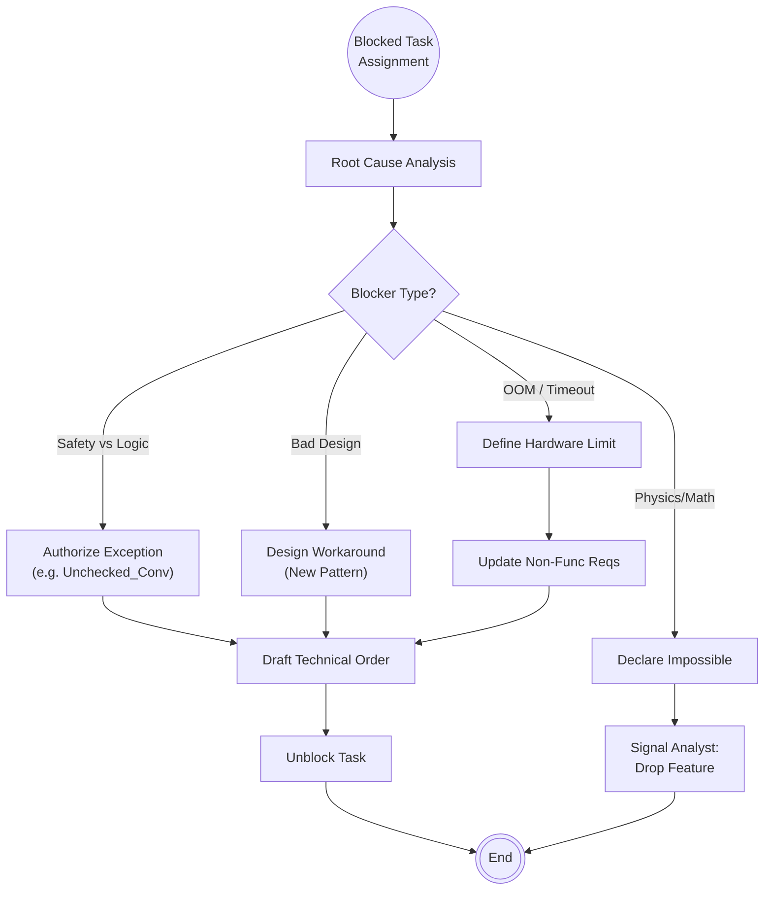

<!--
  Mandelbrot Explorer
  Copyright (C) 2026 Marcin Kaim

  This program is free software: you can redistribute it and/or modify
  it under the terms of the GNU General Public License as published by
  the Free Software Foundation, either version 3 of the License, or
  (at your option) any later version.

  This program is distributed in the hope that it will be useful,
  but WITHOUT ANY WARRANTY; without even the implied warranty of
  MERCHANTABILITY or FITNESS FOR A PARTICULAR PURPOSE.  See the
  GNU General Public License for more details.

  You should have received a copy of the GNU General Public License
  along with this program.  If not, see <https://www.gnu.org/licenses/>.
-->

# Scenario: TECHNICAL_INTERVENTION

## 1. Objective

**Resolve High-Level Deadlocks.**

The objective of this scenario is to handle "Blocked" states that exceed the authority or capability of the Engineer. These are typically issues where the solution requires **breaking an existing rule**, introducing a new dependency, or acknowledging a hardware limitation. The Architect acts as the supreme arbiter to unblock the Execution Loop.

## 2. Process Flow Diagram

## 3. Triggers

This routine is invoked exclusively when:

1. **Manager Escalation:** A task status is set to `BLOCKED` in `00-roadmap-status.md` and assigned to the Architect.
2. **Audit Stalemate:** The Engineer and Auditor cannot agree on a solution (e.g., Auditor demands safety, Engineer claims it breaks performance). The Architect is summoned to cast the tie-breaking vote.

## 4. Input Data

* **The Blocker Report:** The Action Report (`AR-*-blocked.md`) generated by the Engineer/Auditor.
* **The Code:** The current state of the branch causing the issue.
* **The Constraints:** `REQ-003` (Safety) and `ADR` library.

## 5. Execution Algorithm

### Step 1: Root Cause Analysis

* **Action:** The Architect examines the evidence.
* **Key Questions:**
    * Is this a **Knowledge Gap**? (Engineer doesn't know how).
    * Is this a **Tooling Failure**? (GNAT/SPARK prover failure).
    * Is this a **Constraint Violation**? (Impossible to do X safely).

### Step 2: Strategy Selection

#### Strategy A: The "Executive Override" (Bypassing Rules)

* **Context:** The task is impossible without violating an existing rule (e.g., using `Unchecked_Conversion` for CUDA interaction).
* **Action:**
    1. The Architect drafts a specific permission note.
    2. If the violation is permanent, a new **ADR** is created/amended.
    3. *Output:* "Permission granted to use unsafe cast in module X only. Justification: Hardware Interface."

#### Strategy B: The "Architecture Pivot" (Refactoring)

* **Context:** The current implementation path leads to a dead end (e.g., "Recursion not allowed in CUDA").
* **Action:**
    1. The Architect designs a new pattern (e.g., "Use Iterative Stack Approach").
    2. Creates a proof-of-concept snippet in `00-drafts/`.
    3. *Output:* "Abandon recursion. Implement the Stack pattern defined in `DRAFT-XX`."

#### Strategy C: The "Scope Reduction" (Hardware Limits)

* **Context:** The feature kills the GPU (e.g., OOM on RTX 3500).
* **Action:**
    1. The Architect formally establishes the limit.
    2. Updates `REQ-003` (via Analyst collaboration) to reflect reality (e.g., "Max Zoom restricted to 10^14").
    3. *Output:* "Optimization target lowered. Proceed with limits defined in updated REQ."

### Step 3: Issuing the Technical Order

* **Action:** The Architect produces an artifact to unblock the Engineer.
* **Format:** A markdown file in the Task's report folder (e.g., `AR-0X-architect-intervention.md`) or a direct append to the Task Definition.
* **Content:**
    * **Diagnosis:** What went wrong.
    * **The Fix:** Step-by-step technical instruction.
    * **Authorization:** "I take responsibility for this deviation."

### Step 4: State Restoration

* **Action:** Signal the Manager.
* **Outcome:**
    * If fixed: Task Status `BLOCKED`  `ACTIVE`. Owner  `Engineer`.
    * If impossible: Task Status `BLOCKED`  `DRAFTING`. Owner  `Analyst`.

## 6. Exception Handling

* **The "Research Spike":** If the Architect cannot solve the issue immediately, they must not stall the pipeline.
    * **Action:** Request the Analyst to convert the Feature Task into a "Research Task" (Time-boxed investigation).
    * **Goal:** Buy time to find a solution without blocking the Roadmap.
