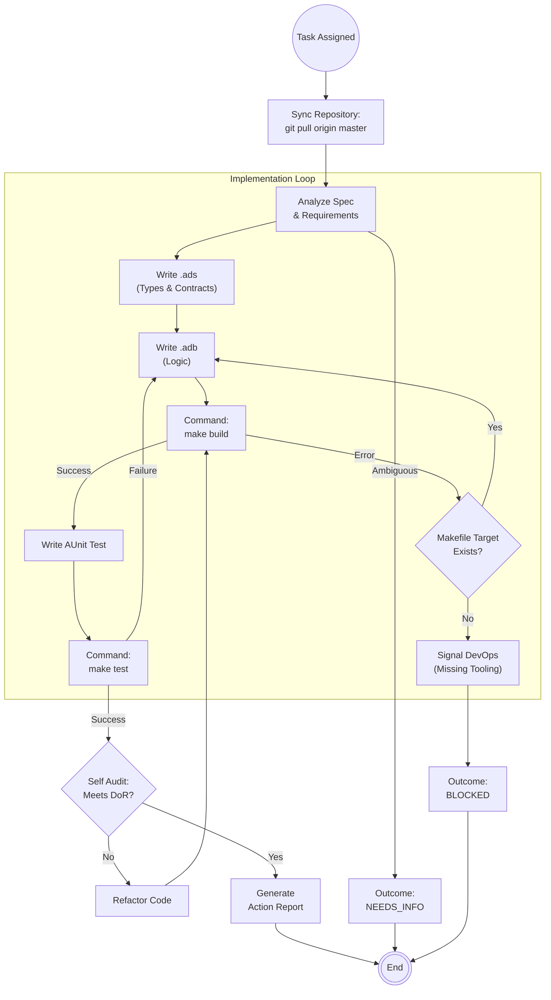

<!--
  Mandelbrot Explorer
  Copyright (C) 2026 Marcin Kaim

  This program is free software: you can redistribute it and/or modify
  it under the terms of the GNU General Public License as published by
  the Free Software Foundation, either version 3 of the License, or
  (at your option) any later version.

  This program is distributed in the hope that it will be useful,
  but WITHOUT ANY WARRANTY; without even the implied warranty of
  MERCHANTABILITY or FITNESS FOR A PARTICULAR PURPOSE.  See the
  GNU General Public License for more details.

  You should have received a copy of the GNU General Public License
  along with this program.  If not, see <https://www.gnu.org/licenses/>.
-->

# Scenario: FEATURE_IMPLEMENTATION

## 1. Objective

**Convert Spec to Working Code.**

The objective of this scenario is to transform a static **Task Definition** into compiled, working, and tested **Source Code**. The Engineer works directly on the main branch, adhering to the "Contract-First" design (using Ada 2022 `Pre`/`Post` aspects for runtime safety) and utilizing the project's standardized `Makefile` interface.

## 2. Process Flow Diagram

## 3. Triggers

This routine is invoked when:

1. **Manager Notification:** The Engineer receives a dispatch command (`@Engineer, start task X`).
2. **Roadmap Update:** A task assigned to the Engineer enters `ACTIVE` state.

## 4. Input Data

* **Primary:** The Task Definition in `docs/control/05-tasks/01-epics/`.
* **Constraints:** `01-requirements/` and `04-architecture/`.
* **Environment:** The local source tree (`src/`) on the Debian 13 workstation, managed via `Makefile`.

## 5. Execution Algorithm

### Step 1: Workspace Synchronization (Trunk-Based)

* **Action:** Ensure the local workspace is strictly synchronized with the remote source of truth.
* **Command:** `git checkout master && git pull origin master`.
* **Constraint:** We do not use feature branches. All work is performed on `master`. The Engineer is responsible for resolving conflicts immediately upon starting.

### Step 2: Analysis & Contract Design (The .ads Phase)

* **Action:** Translate requirements into Ada specifications.
* **Focus:**
    * Define strong types (avoid generic types; use `range`).
    * **Runtime Contracts:** Write `Pre` (Preconditions) and `Post` (Postconditions) aspects.
    * *Note:* These contracts are for **Runtime Checks** and documentation, not for static formal proof (`gnatprove` is disabled for this project).

### Step 3: Implementation (The .adb Phase)

* **Action:** Write the imperative logic to satisfy the specification.
* **Tooling:** Use **ONLY** commands defined in the `Makefile`.
* **Command:** `make build` (or specific target).
* **Missing Tooling Protocol:**
    * If a necessary command (e.g., specific linter, formatter, or build flag) is missing from the `Makefile`:
    * **DO NOT** run raw commands (`alr`, `gcc`) manually.
    * **DO** Report `BLOCKED` status and request DevOps intervention to update the `Makefile`.

### Step 4: Unit Testing (The Dynamic Check)

* **Action:** Write **AUnit** test cases in `tests/`.
* **Command:** `make test`.
* **Requirement:** Tests must verify that the `Post` contracts hold true under valid inputs and that `Pre` violations are handled (if exception propagation is enabled).

### Step 5: Self-Audit (The Quality Gate)

Before declaring victory, the Engineer performs a checklist:

1. **Compilation:** Does `make build` pass with zero errors?
2. **Testing:** Does `make test` report all passed?
3. **Style:** Does the code look consistent? (If `make fmt` or `make lint` exists, run it).

## 6. Output Artifacts

* **Source Code:** Modified files in `src/` and `tests/` (Staged but NOT committed yet - the Auditor will review the diff or the Engineer commits based on project policy).
* **Evidence:** Logs from `make build` and `make test`.

## 7. Exception Handling

### Case A: Missing Makefile Target

* **Condition:** Engineer needs to clean the build, but `make clean` is not defined.
* **Action:**
    1. Draft a **Partial Action Report**.
    2. Outcome: `BLOCKED`.
    3. Justification: "Missing `make clean` target in Makefile. Requesting DevOps support."

### Case B: Specification Ambiguity

* **Condition:** Task Definition lacks specific bounds or logic details.
* **Action:**
    1. Draft a **Partial Action Report**.
    2. Outcome: `NEEDS_INFO`.
    3. Justification: "Ambiguous requirement in Task Definition."
