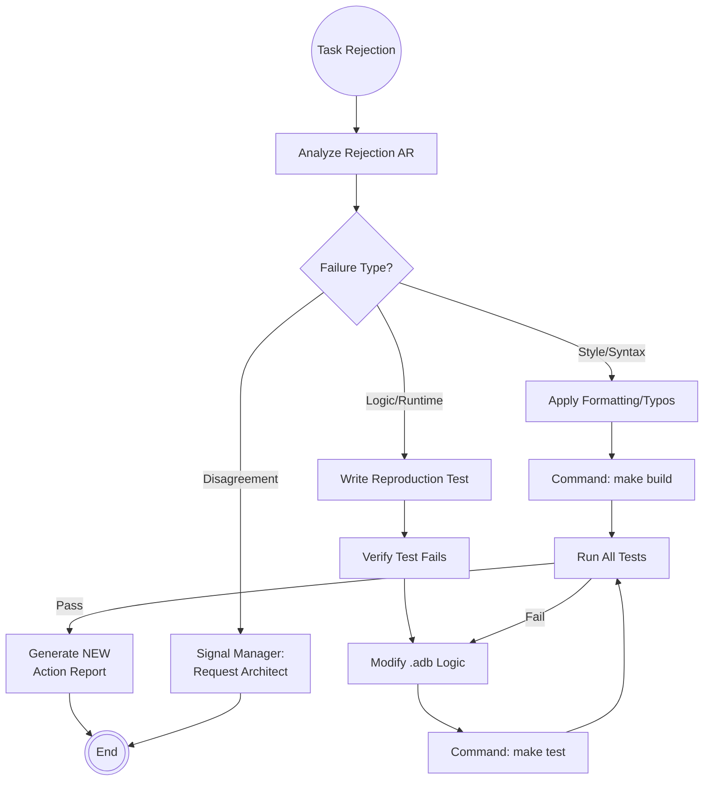

# Scenario: FEEDBACK_RESOLUTION

## 1. Objective

**Close the Quality Loop.**

The objective of this scenario is to address defects, non-compliance issues, or bugs reported by the **Auditor** (Static Analysis/Code Review) or **Tester** (Dynamic Validation). The Engineer must analyze the rejection, reproduce the issue, apply a fix, and verify that no regressions were introduced.

## 2. Process Flow Diagram

## 3. Triggers

This routine is invoked when:

1. **Rejection Notification:** The Manager notifies the Engineer that a task has been moved back from `AUDIT` or `VALIDATION` to `ACTIVE` status.
2. **Input Artifact:** A new Action Report with `Outcome: FAILURE` appears in the task folder.

## 4. Input Data

* **The Rejection Report:** `AR-[Seq]-auditor-report.md` or `AR-[Seq]-tester-report.md`.
* **Evidence:** Specific error messages, screenshot, or line numbers cited in the report.

## 5. Execution Algorithm

### Step 1: Diagnosis & Reproduction

* **Action:** The Engineer must validate the claim before touching the code.
* **For Logic Errors:**
    * Create a new test case in `tests/` that specifically triggers the reported bug.
    * Run `make test`. Confirm it fails. (Red phase of TDD).
* **For Style/Static Errors:**
    * Locate the specific file/line.
    * Verify the violation against the referenced **ADR** or Guideline.

### Step 2: Implementation (The Fix)

* **Action:** Modify the source code on the `master` branch to resolve the issue.
* **Constraint:** Changes must be minimal and scoped *only* to the reported defect. "Drive-by refactoring" of unrelated code is prohibited as it complicates re-verification.

### Step 3: Verification (The Fix)

* **Action:** Prove the fix works.
* **Command:**
    * `make build` (Must succeed).
    * `make test` (Must succeed, including the new reproduction test).

### Step 4: Regression Testing (The Safety Net)

* **Action:** Ensure the fix didn't break anything else.
* **Command:** Run the full test suite (all tests, not just the new one).
* **Rule:** If any existing test fails, the fix is rejected. The Engineer must rollback and find a non-destructive solution.

### Step 5: Resubmission

* **Action:** Generate a **new** Action Report.
* **Format:** Do *not* edit the Rejection AR. Create a new file (e.g., `AR-03-engineer-fix.md`).
* **Content:**
    * Reference the Rejection AR (e.g., "Resolves issues reported in AR-02").
    * Describe the Fix.
    * Provide new evidence (Logs showing clean build/test).

## 6. Output Artifacts

* **Source Code:** Corrected `.ads` / `.adb` files.
* **Test Code:** New regression tests.
* **Action Report:** A fresh report signaling readiness for re-audit.

## 7. Exception Handling

### Case A: The "False Positive" / Disagreement

* **Condition:** The Engineer believes the code is correct and the Auditor/Tester is wrong (e.g., Auditor misread the spec, or Tester used an invalid environment).
* **Action:**
    1. Do not modify the code.
    2. Draft a generic Action Report.
    3. Outcome: `BLOCKED`.
    4. Justification: "Dispute validity of rejection. Requesting Architect arbitration." (Triggers `TECHNICAL_INTERVENTION`).

### Case B: Tooling Divergence

* **Condition:** "It works on my machine but failed for the Tester."
* **Action:**
    1. This indicates an environment drift.
    2. The Engineer must assume their environment is "dirty" or the `Makefile` is incomplete.
    3. Collaborate with **DevOps** to sanitize the build environment before attempting another fix.
