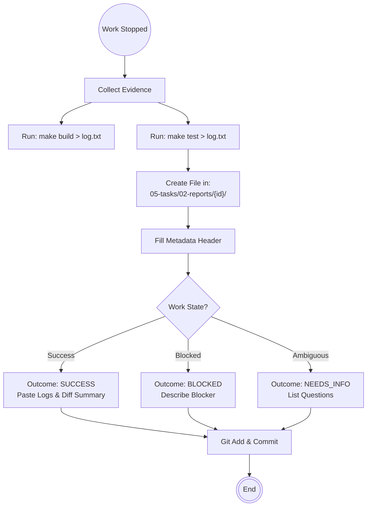

# Scenario: GENERATING_ACTION_REPORTS

## 1. Objective

**Formalize the Handoff.**

The objective of this scenario is to create the immutable artifact that signals the completion of an Engineer's work cycle. The **Action Report (AR)** serves as the bridge between the Execution Loop (Coding) and the Management Loop (Scheduling). Without an AR, the work effectively does not exist in the system.

## 2. Process Flow Diagram



## 3. Triggers

This routine is invoked immediately after:

1. **Successful Self-Audit:** The Engineer has finished implementation and passed local verification (`FEATURE_IMPLEMENTATION`).
2. **Fix Verification:** The Engineer has resolved issues reported by an Auditor (`FEEDBACK_RESOLUTION`).
3. **Exception Event:** The Engineer has hit a wall (`BLOCKED` or `NEEDS_INFO`).

## 4. Input Data

* **Template:** `docs/control/02-workflow/02-document-templates/template-action-report.md`.
* **Evidence:**
    * Standard Output/Error from `make build`.
    * Standard Output from `make test`.
    * List of modified files (`git status`).


## 5. Execution Algorithm

### Step 1: File Creation

* **Location:** Navigate to `docs/control/05-tasks/02-reports/`.
* **Subdirectory:** If a folder for the `Task ID` does not exist, create it.
* **Naming Convention:** `AR-[Seq]-[Role]-[Context].md`.
    * `Seq`: Monotonically increasing (01, 02, 03...).
    * `Role`: `engineer`.
    * `Context`: e.g., `implementation`, `fix`, `blocker`.
    * *Example:* `AR-01-engineer-implementation.md`.


### Step 2: Metadata Injection

* **Action:** Populate the YAML frontmatter or Header Table strictly.
* **Fields:**
    * `Task ID`: Link to the parent task.
    * `Author`: Engineer.
    * `Date`: Current timestamp.
    * `Outcome`: Select one from [`SUCCESS`, `BLOCKED`, `NEEDS_INFO`].
    * `Next Phase`:
        * If `SUCCESS`  `AUDIT`.
        * If `BLOCKED`  `BLOCKED`.
        * If `NEEDS_INFO`  `DRAFTING`.


### Step 3: The Narrative (Summary)

* **Action:** Describe *what* was done concisely.
* **Content:**
    * "Implemented module X."
    * "Added `Pre` contracts to function Y."
    * "Added 3 unit tests covering edge cases."


### Step 4: The Evidence (Proof of Work)

* **Constraint:** Do not just say "It works." **Prove it.**
* **Action:**
    * Create a section `## Evidence`.
    * Create a code block (```text).
    * Paste the full output of `make build`.
    * Paste the full output of `make test`.
    * *Note:* If the output is massive, paste the summary lines (e.g., "Build finished successfully", "Tests: 15 Passed, 0 Failed").


### Step 5: Commit to Repository

* **Action:** The AR is part of the repo.
* **Command:**
    ```bash
    git add docs/control/05-tasks/02-reports/...
    git commit -m "docs: Add AR for Task [ID]"

    ```
* *Note:* In this Trunk-Based workflow, the AR is committed alongside the code (or immediately after) to `master`.

## 6. Output Artifacts

* **The File:** A markdown file that the Manager will detect in the next cycle.

## 7. Exception Handling

### Case A: Forgotten Evidence

* **Condition:** Engineer submits an AR with `Outcome: SUCCESS` but creates an empty "Evidence" section.
* **Consequence:** The **Auditor** will immediately reject it (Feedback Loop).
* **Prevention:** Always run `make` commands and copy output *before* starting the report.

### Case B: Concurrent Reports

* **Condition:** Two Engineers are working on sub-tasks and try to create `AR-01` simultaneously.
* **Action:**
    1. `git pull` reveals the conflict.
    2. Rename local report to `AR-02`.
    3. Push again.
