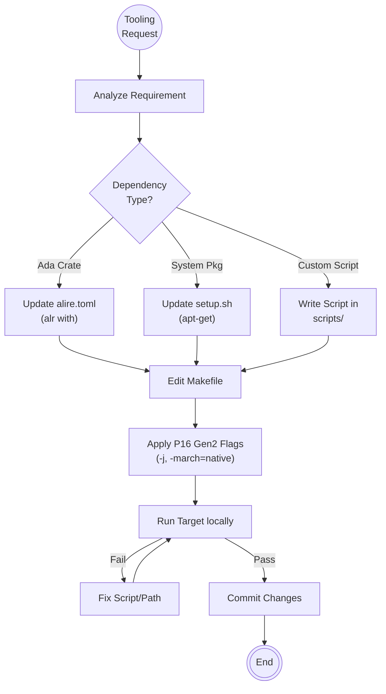

<!--
  Mandelbrot Explorer
  Copyright (C) 2026 Marcin Kaim

  This program is free software: you can redistribute it and/or modify
  it under the terms of the GNU General Public License as published by
  the Free Software Foundation, either version 3 of the License, or
  (at your option) any later version.

  This program is distributed in the hope that it will be useful,
  but WITHOUT ANY WARRANTY; without even the implied warranty of
  MERCHANTABILITY or FITNESS FOR A PARTICULAR PURPOSE.  See the
  GNU General Public License for more details.

  You should have received a copy of the GNU General Public License
  along with this program.  If not, see <https://www.gnu.org/licenses/>.
-->

# Scenario: TOOLCHAIN_MANAGEMENT

## 1. Objective

**Maintain the Build Interface.**

The objective of this scenario is to provide a deterministic, robust, and optimized build interface via the project's root `Makefile`. The DevOps Agent ensures that Engineers can interact with the codebase using standard verbs (`build`, `test`, `clean`) without needing to understand the underlying complexity of Alire, GNAT, or CUDA linkers.

## 2. Process Flow Diagram



## 3. Triggers

This routine is invoked when:

1. **Engineer Request:** An Engineer reports `BLOCKED` because a necessary command (e.g., `make lint`) is missing.
2. **Architecture Decision:** The Architect publishes an ADR requiring a new tool (e.g., "Adopt `gnatpp` for formatting").
3. **System Upgrade:** Debian 13 updates key libraries (e.g., GCC or CUDA drivers), requiring flag adjustments.

## 4. Input Data

* **The Interface:** Current `Makefile`.
* **Dependency Manifests:** `alire.toml` (Ada), `package.json` (Node tooling), `setup.sh` (System).
* **Hardware Context:** Lenovo ThinkPad P16 Gen2 (Optimize for i7-13850HX & RTX 3500).

## 5. Execution Algorithm

### Step 1: Dependency Resolution

* **Action:** Identify the correct source for the requested tool.
* **Hierarchy:**
    1. **Alire (Ada):** Prefer `alr index` for Ada libraries/tools.
    2. **Debian Repos:** Use `apt` for system tools (ensure availability in Debian 13 Trixie).
    3. **Local Scripts:** If no package exists, write a wrapper script.


### Step 2: Script Implementation (If required)

* **Action:** Create robust scripts in `scripts/`.
* **Constraint:** All Bash scripts must begin with the "Safety Preamble":
    ```bash
    #!/bin/bash
    set -euo pipefail

    ```
* **Naming:** `scripts/[verb]-[noun].sh` (e.g., `install-hooks.sh`).

### Step 3: Makefile Engineering

* **Action:** Expose the tool via a Phony Target in the `Makefile`.
* **Standard Targets:**
    * `build`: Compile the project (optimized).
    * `test`: Run the test suite.
    * `clean`: Remove artifacts (`alr clean`, `rm -rf obj`).
    * `fmt`: Apply code formatting.
    * `lint`: Run static analysis checks.


* **Hardware Optimization:**
    * Inject parallelism flags (`-j$(nproc)`) to leverage the i7-13850HX cores.
    * Ensure CUDA library paths match the specific driver version on the P16.


### Step 4: Verification (The "Clean Room" Test)

* **Action:** Verify that the new target works in a fresh shell context.
* **Check:**
    * Does `make clean && make [new-target]` succeed?
    * are no hardcoded paths (e.g., `/home/user/...`) used? Use relative paths or `$(shell pwd)`.


## 6. Output Artifacts

* **Updated Makefile:** The primary artifact.
* **Helper Scripts:** New files in `scripts/`.
* **Documentation:** Comments inside the `Makefile` explaining *what* each target does.

## 7. Exception Handling

### Case A: Dependency Conflict

* **Condition:** Update to `alire.toml` breaks existing build due to version mismatch.
* **Action:**
    1. Lock the versions in `alire.lock`.
    2. If unresolved, create a `BLOCKED` report for the **Architect** to decide on dependency strategy.


### Case B: Hardware Divergence

* **Condition:** A flag works on the P16 but fails in CI (or vice-versa).
* **Action:**
    1. Introduce conditional logic in Makefile:
        ```makefile
        ifdef CI
            FLAGS=...
        else
            FLAGS=-march=native ...
        endif

        ```
