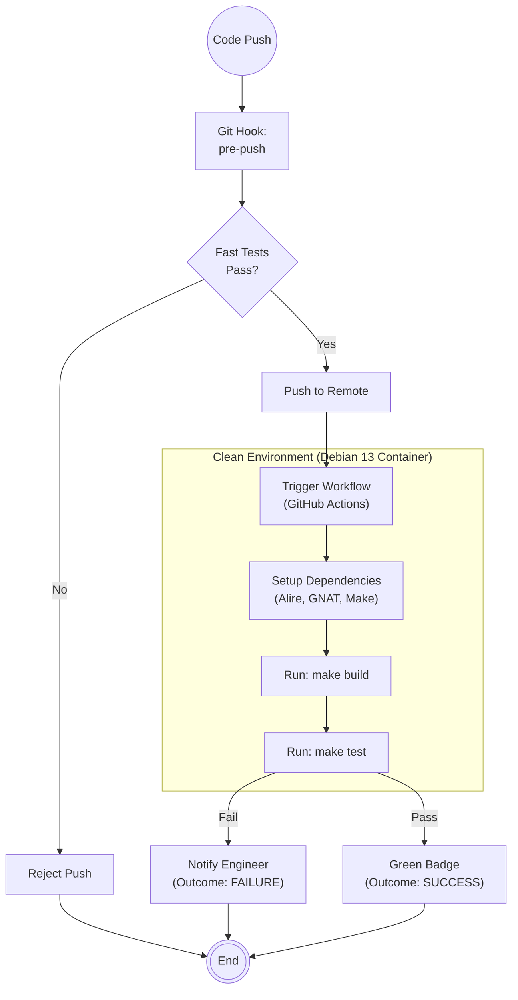

# Scenario: CICD_MAINTENANCE

## 1. Objective

**Automate Verification.**

The objective of this scenario is to maintain the Continuous Integration / Continuous Delivery pipeline. This system acts as the "Impartial Judge," running the build and test suite in a clean, isolated environment (simulating the Production environment) every time code is modified. This ensures that the `master` branch remains deployable at all times.

## 2. Process Flow Diagram



## 3. Triggers

This routine is invoked when:

1. **Pipeline Failure:** The current CI configuration fails to build valid code (false positive).
2. **New Requirements:** The Architect mandates a new check (e.g., "Run linter on every commit").
3. **Performance Degradation:** The CI process takes too long (>5 minutes), slowing down the feedback loop.

## 4. Input Data

* **Pipeline Definition:** `.github/workflows/*.yml` (or local equivalent).
* **Build Interface:** The `Makefile` (CI must strictly use `make` commands).
* **Dependencies:** `alire.lock` to ensure the CI uses exactly the same library versions as the Engineer.

## 5. Execution Algorithm

### Step 1: Local Hooks Configuration (The First Line of Defense)

* **Action:** Configure Git hooks to prevent bad code from leaving the local workstation.
* **Mechanism:**
    * Create/Edit `.git/hooks/pre-push`.
    * Script content:
        ```bash
        #!/bin/bash
        # Run fast tests before allowing push
        make build && make test

        ```
* **Goal:** Save compute resources and time by catching obvious errors locally.

### Step 2: Environment Parity

* **Action:** Ensure the CI runner mirrors the Lenovo P16 / Debian 13 environment as closely as possible.
* **Mechanism:**
    * Use a Docker container or a specific runner image (e.g., `debian:trixie-slim`) in the workflow definition.
    * Install dependencies defined in `setup.sh` inside the CI runner.


### Step 3: Workflow Definition (YAML)

* **Action:** Define the steps in `.github/workflows/main.yml`.
* **Standard Steps:**
    1. **Checkout:** Get code.
    2. **Cache:** Restore `alire` and `obj` directories to speed up execution.
    3. **Setup:** Install toolchain (GNAT, Make).
    4. **Verification:**
        * `make build` (Check compilation).
        * `make test` (Check logic).
* **Optimization:** Configure concurrent jobs if tests can run in parallel.

### Step 4: Maintenance & Tuning

* **Action:** Monitor pipeline duration.
* **Logic:**
    * If duration > 5 mins  Investigate caching strategy or split jobs.
    * If sporadic failures ("Flaky tests")  Signal **Engineer** to fix the test, or isolate the test in the config.


## 6. Output Artifacts

* **Configuration:** `.github/workflows/main.yml`.
* **Scripts:** `.git/hooks/pre-push` (distributed via `scripts/install-hooks.sh`).
* **Status:** Build Badges (Passing/Failing) in `README.md`.

## 7. Exception Handling

### Case A: "It works locally, fails in CI"

* **Condition:** A classic environment drift.
* **Action:**
    1. The DevOps Agent inspects the CI logs.
    2. Identifies the missing dependency (e.g., CI lacks a specific shared library present on the P16).
    3. Updates the CI `Setup` step to install the missing package.
    4. *Rule:* Never change code to fix CI; fix the Environment.


### Case B: Resource Limits

* **Condition:** CI runner crashes (OOM) due to heavy compilation.
* **Action:**
    1. Adjust `Makefile` parallelism flags for CI context.
    2. Example: `make build -j2` in CI vs `make build -j16` on the P16.
