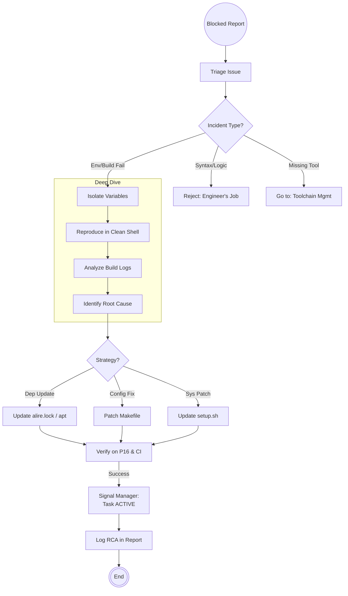

<!--
  Mandelbrot Explorer
  Copyright (C) 2026 Marcin Kaim

  This program is free software: you can redistribute it and/or modify
  it under the terms of the GNU General Public License as published by
  the Free Software Foundation, either version 3 of the License, or
  (at your option) any later version.

  This program is distributed in the hope that it will be useful,
  but WITHOUT ANY WARRANTY; without even the implied warranty of
  MERCHANTABILITY or FITNESS FOR A PARTICULAR PURPOSE.  See the
  GNU General Public License for more details.

  You should have received a copy of the GNU General Public License
  along with this program.  If not, see <https://www.gnu.org/licenses/>.
-->

# Scenario: INCIDENT_RESOLUTION

## 1. Objective

**Unblock the Execution Loop.**

The objective of this scenario is to rapidly diagnose and resolve structural blockages that prevent Engineers from working. These include build failures, environment divergence ("works on my machine"), dependency conflicts, and CI pipeline outages. The focus is on **Systemic Fixes** (updating the `Makefile` or scripts) rather than temporary patches.

## 2. Process Flow Diagram

## 3. Triggers

This routine is invoked when:

1. **Status BLOCKED:** An Engineer submits an Action Report with `Outcome: BLOCKED` citing environment/tooling issues.
2. **CI Failure:** The master pipeline breaks despite no changes to code (e.g., upstream dependency update in Debian Trixie).
3. **Performance Alert:** Build times exceed acceptable thresholds (e.g., > 10 min), requiring optimization.

## 4. Input Data

* **The Error:** Logs provided in the Engineer's Action Report or CI console output.
* **The State:** `git status`, `alr version`, `uname -a`, `nvidia-smi` (if GPU related).
* **The Config:** `Makefile`, `alire.toml`, `setup.sh`.

## 5. Execution Algorithm

### Step 1: Triage (The Filter)

* **Action:** Determine jurisdiction.
* **Logic:**
    * "Constraint_Error at runtime"  **Engineer** (Code bug).
    * "File not found: gnat"  **DevOps** (Environment).
    * "ld: cannot find -lcuda"  **DevOps** (Linker/Path).
    * "Undefined reference to..."  **DevOps** (Missing import/library) OR **Engineer** (Missing body).

### Step 2: Reproduction (The Clean Room)

* **Action:** Attempt to reproduce the error in a controlled scope.
* **Command:**
    * Use `make clean` first to rule out stale artifacts.
    * If local: Run the exact command the Engineer failed on.
    * If CI: Trigger a debug run or inspect artifacts.

### Step 3: The Fix Implementation

* **Action:** Apply the fix to the repository (e.g., revert bad commit, patch Dockerfile).
* **Verification:** Run the build locally to ensure homeostasis is restored.

### Step 4: Reporting (The Formal Closure)

* **Artifact:** Create an **Action Report** (AR).
* **Template:** `docs/control/02-workflow/02-document-templates/template-action-report.md`.
* **Metadata Requirements:**
    * `Role`: `DEVOPS`.
    * `Relates To`: `BUG-[ID]` or the `Commit Hash` that caused the failure.
    * `Input Commit`: The state *before* your fix.
    * `Outcome`: `SUCCESS` (System Restored).
* **Content Mapping:**
    * **Executive Summary:** This acts as the **Post-Mortem**. Briefly explain Root Cause Analysis (RCA).
    * **Technical Details:** Diff of the fix.
    * **Evidence:** Logs showing the build passing again.

## 6. Output Artifacts

* **Code:** Commits to `Makefile`, `scripts/`, or configuration files.
* **Documentation:** A brief **Root Cause Analysis (RCA)** appended to the original Incident Report (so we learn from mistakes).

## 7. Exception Handling

### Case A: Upstream Instability (Debian Trixie)

* **Condition:** A system package update (e.g., `gcc-14` to `gcc-15`) breaks the build.
* **Action:**
    1. DevOps locks the project to the older working version via `apt` pinning preferences in `setup.sh`.
    2. Creates a long-term task to support the new compiler version.

### Case B: The "Heisenbug" (Flaky CI)

* **Condition:** CI fails 1 out of 10 times with no code changes.
* **Action:**
    1. Do not ignore.
    2. Instrument the CI with verbose logging (`-v`).
    3. If purely environmental (e.g., network timeout fetching crates), add retry logic to the script.
