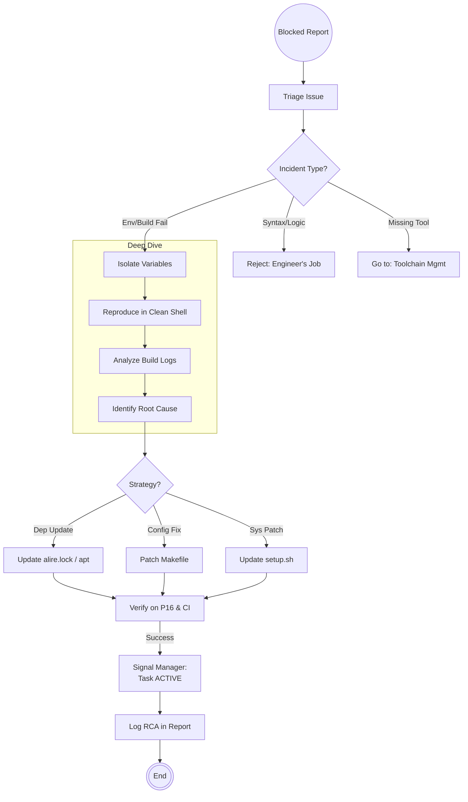

# Scenario: INCIDENT_RESOLUTION

## 1. Objective

**Unblock the Execution Loop.**

The objective of this scenario is to rapidly diagnose and resolve structural blockages that prevent Engineers from working. These include build failures, environment divergence ("works on my machine"), dependency conflicts, and CI pipeline outages. The focus is on **Systemic Fixes** (updating the `Makefile` or scripts) rather than temporary patches.

## 2. Process Flow Diagram

## 3. Triggers

This routine is invoked when:

1. **Status BLOCKED:** An Engineer submits an Action Report with `Outcome: BLOCKED` citing environment/tooling issues.
2. **CI Failure:** The master pipeline breaks despite no changes to code (e.g., upstream dependency update in Debian Trixie).
3. **Performance Alert:** Build times exceed acceptable thresholds (e.g., > 10 min), requiring optimization.

## 4. Input Data

* **The Error:** Logs provided in the Engineer's Action Report or CI console output.
* **The State:** `git status`, `alr version`, `uname -a`, `nvidia-smi` (if GPU related).
* **The Config:** `Makefile`, `alire.toml`, `setup.sh`.

## 5. Execution Algorithm

### Step 1: Triage (The Filter)

* **Action:** Determine jurisdiction.
* **Logic:**
    * "Constraint_Error at runtime"  **Engineer** (Code bug).
    * "File not found: gnat"  **DevOps** (Environment).
    * "ld: cannot find -lcuda"  **DevOps** (Linker/Path).
    * "Undefined reference to..."  **DevOps** (Missing import/library) OR **Engineer** (Missing body).

### Step 2: Reproduction (The Clean Room)

* **Action:** Attempt to reproduce the error in a controlled scope.
* **Command:**
    * Use `make clean` first to rule out stale artifacts.
    * If local: Run the exact command the Engineer failed on.
    * If CI: Trigger a debug run or inspect artifacts.

### Step 3: Resolution Strategies

#### Strategy A: The Dependency Fix

* **Context:** A library version mismatch (DLL Hell) or upstream break in Debian Trixie.
* **Action:**
    * Pin the version in `alire.toml` (e.g., `crate_x = "1.2.0"` instead of `^1.2.0`).
    * Or, create a workaround script to link specific system libraries.
    * *Principle:* Explicit is better than implicit.

#### Strategy B: The Makefile Patch

* **Context:** The build command is missing flags for the specific hardware (RTX 3500 / i7).
* **Action:**
    * Edit `Makefile`.
    * Example: Add `-L/usr/local/cuda/lib64` or change `-j` count.
    * Ensure the fix is portable (use `ifdef` if it breaks other envs).

#### Strategy C: The Environment Reset

* **Context:** The Engineer's environment is hopelessly corrupted.
* **Action:**
    * Instruct Engineer to run `scripts/nuke-and-pave.sh` (a script that cleans all caches: `alr clean`, `ccache -C`, removes `obj/`).
    * Re-run `setup.sh`.

### Step 4: Verification & Closure

* **Action:** Prove the fix works universally.
* **Check:** Run the full `make build && make test` cycle.
* **Handover:** Update the Ticket/Task status to `ACTIVE` and notify the Engineer (`@Engineer, issue resolved in commit hash X`).

## 6. Output Artifacts

* **Code:** Commits to `Makefile`, `scripts/`, or configuration files.
* **Documentation:** A brief **Root Cause Analysis (RCA)** appended to the original Incident Report (so we learn from mistakes).

## 7. Exception Handling

### Case A: Upstream Instability (Debian Trixie)

* **Condition:** A system package update (e.g., `gcc-14` to `gcc-15`) breaks the build.
* **Action:**
    1. DevOps locks the project to the older working version via `apt` pinning preferences in `setup.sh`.
    2. Creates a long-term task to support the new compiler version.

### Case B: The "Heisenbug" (Flaky CI)

* **Condition:** CI fails 1 out of 10 times with no code changes.
* **Action:**
    1. Do not ignore.
    2. Instrument the CI with verbose logging (`-v`).
    3. If purely environmental (e.g., network timeout fetching crates), add retry logic to the script.
