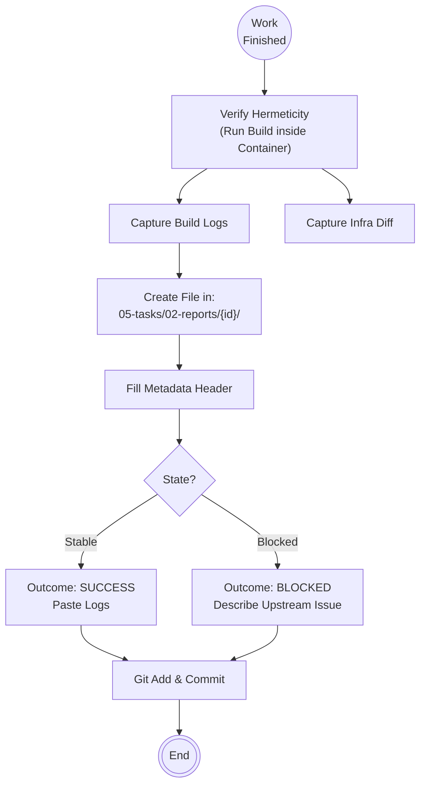

<!--
  Mandelbrot Explorer
  Copyright (C) 2026 Marcin Kaim

  This program is free software: you can redistribute it and/or modify
  it under the terms of the GNU General Public License as published by
  the Free Software Foundation, either version 3 of the License, or
  (at your option) any later version.

  This program is distributed in the hope that it will be useful,
  but WITHOUT ANY WARRANTY; without even the implied warranty of
  MERCHANTABILITY or FITNESS FOR A PARTICULAR PURPOSE.  See the
  GNU General Public License for more details.

  You should have received a copy of the GNU General Public License
  along with this program.  If not, see <https://www.gnu.org/licenses/>.
-->

# Scenario: GENERATING_ACTION_REPORTS

## 1. Objective

**"Seal the Foundation."**

The objective of this scenario is to create an immutable record of changes made to the project's ecosystem. Unlike Code, which is verified by logic, Infrastructure is verified by **Stability**. An Action Report (AR) from DevOps serves as a certificate that the environment (Container, Toolchain, CI Pipeline) is hermetic, reproducible, and ready for Engineers to work in.

## 2. Process Flow Diagram



## 3. Triggers

This routine is invoked immediately after:

1. **Toolchain Upgrade:** Completion of `TOOLCHAIN_MANAGEMENT` (e.g., upgrading GNAT, Alire, or CUDA drivers).
2. **Pipeline Maintenance:** Completion of `CICD_MAINTENANCE` (e.g., modifying `scripts/` or GitHub Actions).
3. **Incident Resolution:** Completion of `INCIDENT_RESOLUTION` (fixing a broken build/environment).

## 4. Input Data

* **Template:** `docs/control/02-workflow/02-document-templates/template-action-report.md`.
* **Context:**
    * The `TASK-ID` (for planned maintenance).
    * The `BUG-ID` or `BROKEN-COMMIT-HASH` (for incidents).
* **Evidence:**
    * Output of `docker build` or `podman build`.
    * Output of `make build` run *inside* the clean container.
    * `git diff --stat` showing changes to non-source files (`alire.toml`, `Containerfile`, `scripts/`).

## 5. Execution Algorithm

### Step 1: File Creation

* **Location:** Navigate to `docs/control/05-tasks/02-reports/`.
* **Subdirectory:**
    * For Tasks: Use the existing task folder.
    * For Critical Incidents (without a task): Create a folder named `incident-[date]-[short-desc]`.
* **Naming Convention:** `AR-[Seq]-devops-[context].md`.
    * *Example:* `AR-01-devops-gnat-upgrade.md` or `AR-02-devops-fix-ci-race`.

### Step 2: Metadata Injection

* **Action:** Populate the YAML frontmatter/Header strictly.
* **Fields:**
    * `Sequence ID`: e.g., `AR-01`.
    * `Relates To`: The Task ID or the Incident ID.
    * `Role`: `DEVOPS`.
    * `Input Commit`: **CRITICAL.** The hash of the repo *before* you started the infra changes.
    * `Outcome`: `SUCCESS` (System is stable) or `BLOCKED` (Waiting for vendor fix).

### Step 3: The Narrative (Process & Reasoning)

* **Action:** Explain the "Why" and "How" of the infrastructure change.
* **Content:**
    * **Root Cause (for Incidents):** "Build failed due to missing `libx11-dev` in the new Debian image."
    * **Change Log:** "Bumped GNAT FSF to 14.1.0 via Alire index update."
    * **Safety Check:** "Verified that the new compiler does not introduce regressions in existing SPARK proofs."

### Step 4: The Evidence (Proof of Hermeticity)

* **Constraint:** Infrastructure must be reproducible.
* **Action:**
    * Create a section `## Evidence`.
    * Paste the log confirming the environment build:
        ```text
        Step 15/15 : RUN make build
        ...
        Build finished successfully.
        Removing intermediate container...
        ```
    * If addressing a specific bug, show the "Before" (Fail) and "After" (Pass) logs.

### Step 5: Commit to Repository

* **Command:**
    ```bash
    git add docs/control/05-tasks/02-reports/...
    git commit -m "docs: DevOps AR for [Task/Incident] [ID]"
    ```
* **Note:** If you modified infrastructure files (e.g., `Containerfile`), they should be part of this same commit or the immediately preceding one (referenced by hash).

## 6. Output Artifacts

* **The File:** A signed attestation that the development environment is operational.

## 7. Exception Handling

### Case A: The "It Works On My Machine" Anomaly

* **Condition:** The build passes locally but fails in CI/GitHub Actions.
* **Action:**
    1. Do **NOT** mark as `SUCCESS`.
    2. Report `Outcome: FAILURE` or keep investigating.
    3. DevOps works on the *Common Denominator*. If it doesn't work in CI, it doesn't work anywhere.


### Case B: Upstream Dependency Failure

* **Condition:** Alire index is down, or Debian repositories are timing out.
* **Action:**
    1. Mark `Outcome: BLOCKED`.
    2. Detail the external outage in the report.
    3. Wait for upstream resolution; do not hack a temporary bypass unless critical.
