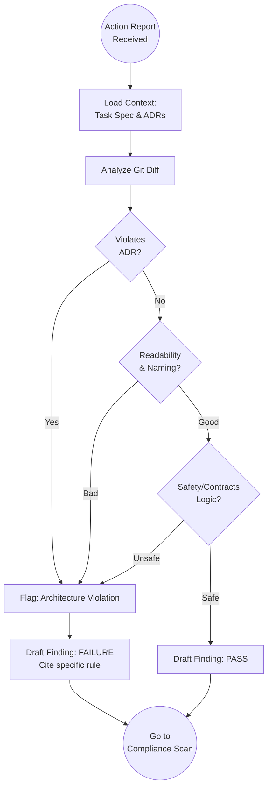

# Scenario: CODE_REVIEW

## 1. Objective

**Verify Intellectual Compliance.**

The objective of this scenario is to perform a human-centric inspection of the source code changes introduced by the Engineer. Unlike automated linters, the Auditor looks for "Logic Rot," violations of Architectural Decision Records (ADRs), readability issues, and safety gaps that tools cannot catch.

## 2. Process Flow Diagram

## 3. Triggers

This routine is invoked when:

1. **Task Handover:** A task status in `00-roadmap-status.md` is updated to `AUDIT`.
2. **Action Report:** A new `AR-*-engineer-*.md` file is committed with `Outcome: SUCCESS`.

## 4. Input Data

* **The Evidence:** The Action Report containing the list of modified files and the commit hash.
* **The Code:** The actual content of `src/` and `tests/` at the specific commit.
* **The Law:** `docs/control/04-architecture/` (ADRs) and `docs/control/01-requirements/`.

## 5. Execution Algorithm

### Step 1: Context Loading

* **Action:** Before looking at the code, understand the intent.
* **Read:** The original **Task Definition** (What was requested?) and the **Engineer's Action Report** (What was delivered?).
* **Check:** Did the Engineer mark any ADRs as "Consulted"?

### Step 2: The Semantic Review (The "Human" Check)

The Auditor reads the code diff line-by-line, applying the following cognitive filters:

#### A. The Architecture Filter (ADR Compliance)

* **Question:** Does this code respect the project's laws?
* **Checks:**
    * Is `Unchecked_Conversion` used? (Violation of Safety, unless authorized).
    * Are raw pointers used where standard types suffice?
    * Does it introduce a new dependency not in `alire.toml`?

#### B. The Safety Filter (Ada/SPARK Best Practices)

* **Question:** Is the code defensively written?
* **Checks:**
    * **Typing:** Are `Integer` or `Float` used blindly? (Should use `type T is range ...`).
    * **Contracts:** Do public subprograms have `Pre` and `Post` aspects defined?
        * *Note:* Even without `gnatprove`, these must logically describe the input/output constraints for Runtime Checks.
    * **Handling:** Are exceptions handled locally or propagated correctly?

#### C. The Maintainability Filter

* **Question:** Will the next Engineer hate this?
* **Checks:**
    * **Naming:** Is it `Snake_Case`? Are variable names descriptive (`velocity_x` vs `v`)?
    * **Comments:** Do comments explain *Why*, not *What*? (e.g., "Adjust for zero-index" is bad; "Offset required by hardware register" is good).
    * **Simplicity:** Is the logic overly complex? (Cyclomatic complexity check).

### Step 3: Defect Flagging

* **Action:** If a violation is found, record it immediately.
* **Format:**
    * **Location:** File + Line Number.
    * **Severity:** `Critical` (Safety/ADR) or `Minor` (Style).
    * **Citation:** Must reference a specific document (e.g., "Violates ADR-005"). Subjective criticism ("I don't like this") is invalid.

## 6. Output Artifacts

* **Internal Notes:** A list of identified defects (to be compiled into the final Audit Report).

## 7. Exception Handling

### Case A: The "Massive Diff"

* **Condition:** The Engineer submits a change affecting > 20 files or > 500 lines of logic in one task.
* **Action:**
    * Immediate Rejection.
    * Reason: "Unreviewable. Violation of Atomicity Principle."
    * Instruction: "Split into smaller tasks."

### Case B: The "Clever Code"

* **Condition:** The code uses an obscure Ada feature to save 2 lines, confusing the Auditor.
* **Action:**
    * Rejection.
    * Reason: "Cognitive Load too high."
    * Instruction: "Rewrite for clarity, even if it is more verbose."
