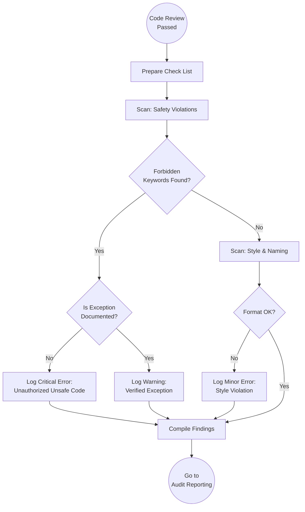

<!--
  Mandelbrot Explorer
  Copyright (C) 2026 Marcin Kaim

  This program is free software: you can redistribute it and/or modify
  it under the terms of the GNU General Public License as published by
  the Free Software Foundation, either version 3 of the License, or
  (at your option) any later version.

  This program is distributed in the hope that it will be useful,
  but WITHOUT ANY WARRANTY; without even the implied warranty of
  MERCHANTABILITY or FITNESS FOR A PARTICULAR PURPOSE.  See the
  GNU General Public License for more details.

  You should have received a copy of the GNU General Public License
  along with this program.  If not, see <https://www.gnu.org/licenses/>.
-->

# Scenario: COMPLIANCE_SCAN

## 1. Objective

**Verify Mechanical Compliance.**

The objective of this scenario is to perform an automated or semi-automated scan of the source code to detect "Forbidden Patterns." This serves as a hard safety gate against features that bypass the Ada type system (e.g., raw memory manipulation) without explicit authorization via an Architecture Decision Record (ADR).

## 2. Process Flow Diagram

## 3. Triggers

This routine is invoked immediately after the **Code Review** scenario concludes (assuming the code wasn't rejected outright for logical flaws).

## 4. Input Data

* **Source Code:** The `src/` directory.
* **The Blacklist:** A set of Ada keywords/packages deemed "Dangerous" by the Architect.
* **The Whitelist:** `docs/control/04-architecture/` (ADRs granting exceptions).

## 5. Execution Algorithm

### Step 1: The Safety Scan (The "Grep" Check)

* **Action:** Search for usage of high-risk features.
* **Command:** Execute strict text searches (using `grep` or IDE search).
* **The Forbidden List:**
    1. `Unchecked_Conversion` (Type system bypass).
    2. `Unchecked_Deallocation` (Manual memory management).
    3. `System.Address` (Raw pointer usage).
    4. `'Address` (Address attribute).
    5. `Import => True` (Foreign Function Interface, unless wrapped).
* **Validation Logic:**
    * **IF** a keyword is found:
    * **THEN** check the preceding line for an authorization tag.
    * *Format:* `-- ALLOWED: [Reason] (See ADR-XXX)`.
    * **IF** tag is missing  **CRITICAL FAILURE**.

### Step 2: The Contract Scan

* **Action:** Ensure "Design by Contract" is respected syntactically.
* **Check:**
    * Do `Pre` and `Post` aspects exist on public subprograms?
    * Are assertions simple enough to be checked at runtime? (Avoid complex quantification loops in assertions if performance is critical).

### Step 3: The Style Scan (Linting)

* **Action:** Verify code hygiene.
* **Tooling:** Run `make lint` (provided by DevOps).
* **Manual Checks (if tool passes but looks wrong):**
    * **Casing:** Keywords should be lowercase (`begin`, `end`), Identifiers MixedCase (`My_Variable`).
    * **Indentation:** Standard 3 spaces (or project standard).
    * **Line Length:** No lines > 120 characters (readability on splitscreen).

### Step 4: Metadata Verification

* **Action:** Check file headers.
* **Check:** Does every new file include the standard License/Copyright header?
* **Check:** Are filenames strictly `snake_case` (e.g., `gpu_manager.adb`, not `GPUManager.adb`)?

## 6. Output Artifacts

* **Scan Results:** A list of mechanical violations (Location, Rule, Severity).

## 7. Exception Handling

### Case A: The "False Positive"

* **Condition:** `grep` finds "Unchecked_Conversion" inside a string literal or a comment explaining why it is *not* used.
* **Action:** Ignore. Use human judgment to verify if it is executable code.

### Case B: The "Authorized Breach"

* **Condition:** Engineer uses `Unchecked_Conversion` to cast a byte array to a float for GPU transfer, and cites `ADR-005`.
* **Action:**
    1. Verify `ADR-005` actually permits this.
    2. If valid, mark as **PASSED (With Note)**.
    3. If invalid (ADR doesn't apply), mark as **FAILURE**.
