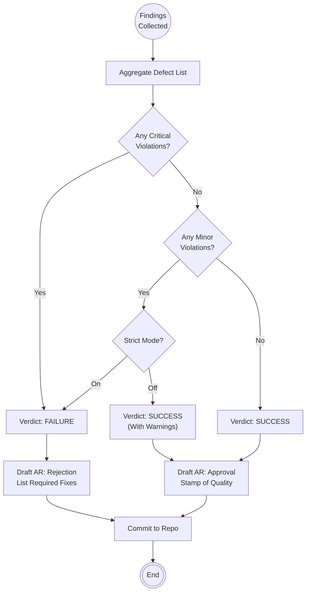

<!--
  Mandelbrot Explorer
  Copyright (C) 2026 Marcin Kaim

  This program is free software: you can redistribute it and/or modify
  it under the terms of the GNU General Public License as published by
  the Free Software Foundation, either version 3 of the License, or
  (at your option) any later version.

  This program is distributed in the hope that it will be useful,
  but WITHOUT ANY WARRANTY; without even the implied warranty of
  MERCHANTABILITY or FITNESS FOR A PARTICULAR PURPOSE.  See the
  GNU General Public License for more details.

  You should have received a copy of the GNU General Public License
  along with this program.  If not, see <https://www.gnu.org/licenses/>.
-->

# Scenario: AUDIT_REPORTING

## 1. Objective

**Formalize the Verdict.**

The objective of this scenario is to synthesize the findings from the Code Review and Compliance Scan into a binding decision. This results in the creation of an **Audit Report** that triggers the next state transition of the Task. The Auditor acts as a gatekeeper: no code enters the "Validation" phase (Dynamic Testing) without a signed Audit Report.

## 2. Process Flow Diagram



## 3. Triggers

This routine is invoked immediately after the completion of `COMPLIANCE_SCAN`.

## 4. Input Data

* **Findings:** Notes taken during `CODE_REVIEW` and `COMPLIANCE_SCAN`.
* **Template:** `template-action-report.md` (Auditors use the same structure as Engineers, but with different metadata).
* **Reference AR:** The Engineer's `AR-[ID]-engineer-implementation.md`.

## 5. Execution Algorithm

### Step 1: Verdict Determination

* **Action:** Review the list of defects found.
* **Logic:**
    * **1+ Critical Defect** (Safety, ADR violation, Bug)  **FAILURE**.
    * **1+ Minor Defect** (Style, Typo, Comment)  **FAILURE** (In this project, we enforce a "Zero Broken Windows" policy).
    * **0 Defects**  **SUCCESS**.


### Step 2: Drafting the Report

* **Location:** `docs/control/05-tasks/02-reports/{Task-ID}/`.
* **Naming:** `AR-[Seq]-auditor-review.md`.
* **Metadata Header:**
    * `Author`: Auditor.
    * `Relates To`: Link to Engineer's AR.
    * `Outcome`: `SUCCESS` or `FAILURE`.
    * `Next Phase`:
        * If `SUCCESS`  `VALIDATION` (Handover to Tester).
        * If `FAILURE`  `ACTIVE` (Handover back to Engineer).


### Step 3: Writing the Content

* **Section 1: Summary**
    * Concise verdict (e.g., "Code logic is sound, but safety violation found in module X").
* **Section 2: Findings (The Bill of Indictment)**
    * Must be a bulleted list.
    * Format: `[Severity] File:Line - Description (Rule Citation)`.
    * *Example:* `[CRITICAL] src/gpu.adb:45 - Unauthorized use of Unchecked_Conversion (Violates ADR-005)`.
* **Section 3: Instructions**
    * Clear steps for the Engineer on what must be fixed.


### Step 4: Publication

* **Action:** Commit the report.
* **Command:**
    ```bash
    git add docs/control/05-tasks/02-reports/...
    git commit -m "docs: Audit Report for Task [ID] - [Outcome]"

    ```


## 6. Output Artifacts

* **The Audit Report:** A permanent record of the review.

## 7. Exception Handling

### Case A: The "Technical Debt" Permit

* **Condition:** A minor violation exists (e.g., complex logic), but fixing it would delay a critical release, and it is safe.
* **Action:**
    1. The Auditor may grant a **Conditional Pass**.
    2. Requirement: The Auditor MUST create a *new* Task Definition: `task-XX-refactor-complex-logic` and place it in the Backlog.
    3. The Audit Report references this new task: "Passing with Technical Debt Ticket: task-XX".


### Case B: Escalation

* **Condition:** The Engineer refuses to accept the finding ("This is not a bug, it's a feature").
* **Action:**
    1. Mark Outcome as `BLOCKED`.
    2. Summon the **Architect** to perform an `IMPACT_ANALYSIS` and issue a final ruling.
