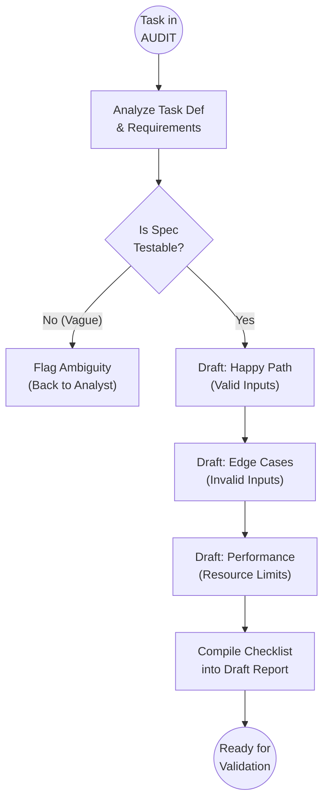

<!--
  Mandelbrot Explorer
  Copyright (C) 2026 Marcin Kaim

  This program is free software: you can redistribute it and/or modify
  it under the terms of the GNU General Public License as published by
  the Free Software Foundation, either version 3 of the License, or
  (at your option) any later version.

  This program is distributed in the hope that it will be useful,
  but WITHOUT ANY WARRANTY; without even the implied warranty of
  MERCHANTABILITY or FITNESS FOR A PARTICULAR PURPOSE.  See the
  GNU General Public License for more details.

  You should have received a copy of the GNU General Public License
  along with this program.  If not, see <https://www.gnu.org/licenses/>.
-->

# Scenario: TEST_PLANNING

## 1. Objective

**Define the Criteria for Success.**

The objective of this scenario is to translate the abstract Requirements and Task Definitions into a concrete, executable checklist of experiments. This ensures that verification is objective, repeatable, and covers both the "Happy Path" (intended usage) and "Edge Cases" (abuse/stress).

## 2. Process Flow Diagram

## 3. Triggers

This routine is invoked when:

1. **Task State Change:** A Task moves to `AUDIT` status. The Tester anticipates work coming their way and begins planning to minimize blocking time.
2. **Requirement Update:** A change in `01-requirements/` forces a revision of existing test plans.

## 4. Input Data

* **The Spec:** `docs/control/05-tasks/01-epics/task-*.md`.
* **The Rules:** `docs/control/01-requirements/`.
* **The Hardware:** Constraints of the **Lenovo ThinkPad P16 Gen2** (Screen resolution, GPU memory limits).

## 5. Execution Algorithm

### Step 1: Requirement Extraction & ambiguity Check

* **Action:** specific measurable criteria from the text.
* **Logic:**
    * "Render the Mandelbrot set"  **Test:** "Is the shape mathematically correct?" (Visual check against reference).
    * "Allow zooming"  **Test:** "Does output change when coordinate X is modified?"
    * "Fast rendering"  **AMBIGUOUS**. Return to Analyst. (Must be: "Render < 16.6ms at 1080p").

### Step 2: Test Case Design (The Checklist)

The Tester categorizes tests into three buckets:

#### Bucket A: Functional (Happy Path)

* **Focus:** Does it work when used as intended?
* **Example:**
    * Input: Center `(0,0)`, Zoom `1.0`.
    * Expected Output: Standard Mandelbrot cardioid visible centrally.

#### Bucket B: Destructive (Edge Cases)

* **Focus:** Can I crash the application?
* **Technique:** Boundary Value Analysis.
    * Input: Zoom `1.0E-16` (Underflow risk).
    * Input: Zoom `1.0E+16` (Overflow risk).
    * Input: Resize window to `1x1` pixel.
    * Input: Resize window to `8000x8000` (VRAM exhaustion risk on RTX 3500).

#### Bucket C: Performance (Non-Functional)

* **Focus:** Does it respect the hardware budget?
* **Example:**
    * Test: Run at Full Screen (WQUXGA). Monitor `nvidia-smi`.
    * Criteria: GPU Load > 0% (Proof of Offload), Frame Time < X ms.

### Step 3: Environment Definition

* **Action:** Define the exact state required for the test.
* **Standard:**
    * OS: Debian 13 (Trixie).
    * Driver: NVIDIA Proprietary (Production version).
    * Background processes: Minimal (simulate dedicated usage).

### Step 4: Artifact Preparation

* **Action:** Initialize the **Validation Report** file (Draft).
* **Format:** Create the file `AR-[Seq]-tester-validation.md` but leave the "Outcome" blank. Populate the "Test Checklist" section with the plan derived above.

## 6. Output Artifacts

* **Test Plan Draft:** A prepared Markdown file in `docs/control/05-tasks/02-reports/` containing the empty checklist, ready to be checked off during execution.

## 7. Exception Handling

### Case A: The Untestable Feature

* **Condition:** A feature depends on non-deterministic behavior (e.g., "Random color generation").
* **Action:**
    1. Define "Statistical Success" (e.g., "Run 100 times, ensure distribution is uniform").
    2. Or, request a "Seed" mechanism from the Engineer to make it deterministic.

### Case B: Hardware Unavailability

* **Condition:** Test requires 4 monitors, but the P16 only supports internal + 2 external.
* **Action:**
    1. Document the limitation in the Test Plan.
    2. Test to the maximum available capacity.
    3. Add a disclaimer: "Validated up to configuration X only."
