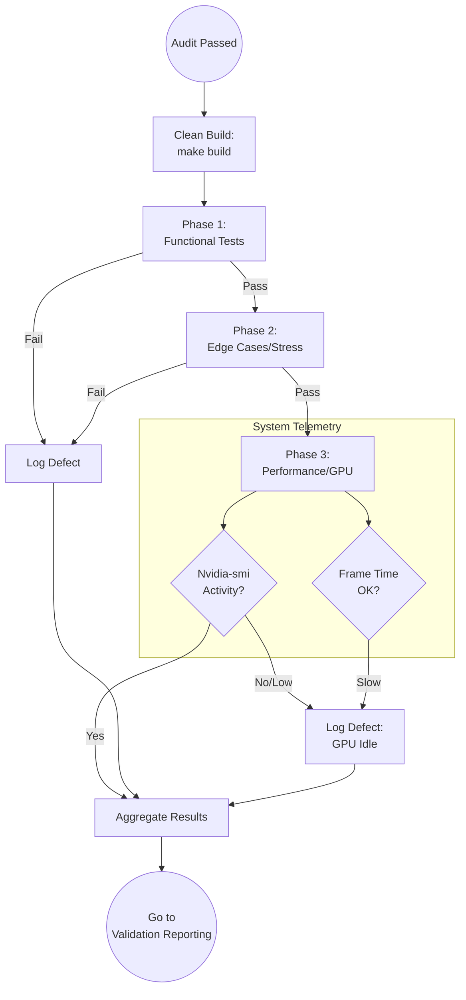

<!--
  Mandelbrot Explorer
  Copyright (C) 2026 Marcin Kaim

  This program is free software: you can redistribute it and/or modify
  it under the terms of the GNU General Public License as published by
  the Free Software Foundation, either version 3 of the License, or
  (at your option) any later version.

  This program is distributed in the hope that it will be useful,
  but WITHOUT ANY WARRANTY; without even the implied warranty of
  MERCHANTABILITY or FITNESS FOR A PARTICULAR PURPOSE.  See the
  GNU General Public License for more details.

  You should have received a copy of the GNU General Public License
  along with this program.  If not, see <https://www.gnu.org/licenses/>.
-->

# Scenario: DYNAMIC_VALIDATION

## 1. Objective

**Execute and Observe.**

The objective of this scenario is to validate the compiled software against the **Test Plan** in the real-world environment. This is a "Black Box" exercise: the Tester interacts with the application strictly through its user interface (CLI or GUI) and system signals, verifying that the implementation matches the intent defined in the **Task Definition** and **Requirements**.

## 2. Process Flow Diagram



## 3. Triggers

This routine is invoked immediately after the **Test Plan** is drafted and the Task status is confirmed as `AUDIT` (passed) or `VALIDATION`.

## 4. Input Data

* **The Artifact:** Freshly compiled binary (e.g., `bin/mandelbrot`).
* **The Plan:** The Checklist generated in `TEST_PLANNING`.
* **The Environment:** Debian 13 (Trixie) with NVIDIA Drivers loaded.

## 5. Execution Algorithm

### Step 1: Clean Deployment

* **Action:** Ensure the binary corresponds exactly to the audited code.
* **Command:**
    ```bash
    make clean
    make build  # Ensure optimization flags are active

    ```
* **Check:** Verify no build errors occur. If they do, fail immediately (Regression).

### Step 2: Phase 1 - Functional Verification (The "What")

* **Action:** Execute the "Happy Path" items from the Test Plan.
* **Method:**
    * Launch the application.
    * Perform the requested user action (e.g., "Press '+' to zoom").
    * **Visual Check:** Does the output match the expected mathematical pattern? Are colors correct?
* **Criterion:** Pass/Fail per item.

### Step 3: Phase 2 - Stress Testing (The "Robustness")

* **Action:** Attempt to break the application.
* **Method:**
    * **Input Spam:** Rapidly toggle inputs.
    * **Window Manager Abuse:** Resize the window frantically (tests the Swap Chain recreation).
    * **Resource Starvation:** Run `stress-ng` in the background (optional) to see if the app hangs or degrades gracefully.
* **Criterion:** App must not Crash (Segfault) or Freeze (Deadlock).

### Step 4: Phase 3 - Performance Verification (The "How Fast")

* **Action:** Verify Hardware Acceleration.
* **Tooling:**
    * Open `watch -n 0.5 nvidia-smi` in a separate terminal.
    * Interact with the Mandelbrot Explorer.
* **Checks:**
    1. **GPU Utilization:** `Volatile GPU-Util` should spike > 0% on the RTX 3500. If it stays at 0%, the app is running on CPU (Defect).
    2. **Memory:** `Memory-Usage` should be within limits defined in `REQ-003`.
    3. **Smoothness:** If `REQ-003` demands 60 FPS, visual stuttering is a failure.


## 6. Output Artifacts

* **Evidence Collection:**
    * **Screenshots:** Use `scrot` or `gnome-screenshot` to capture visual artifacts.
    * **Logs:** Capture `stdout`/`stderr`.
    * **Telemetry:** Snapshot of `nvidia-smi` proving hardware usage.


## 7. Exception Handling

### Case A: The "Heisenbug" (Intermittent Failure)

* **Condition:** The app crashes 1 out of 20 times during resizing.
* **Action:**
    1. Do NOT ignore.
    2. Mark as **FAILURE**.
    3. Attempt to find a reproduction recipe (e.g., "Crash happens only when resizing *up* while zooming *in*").
    4. If reproducible, it's a critical defect.


### Case B: Driver Mismatch

* **Condition:** Application fails to initialize Vulkan/CUDA/OpenGL context.
* **Action:**
    1. Verify if `glxgears` or `nvidia-smi` works independent of the app.
    2. If System tools work but App fails -> **App Defect**.
    3. If System tools fail -> **Environment Issue** (Signal DevOps).
