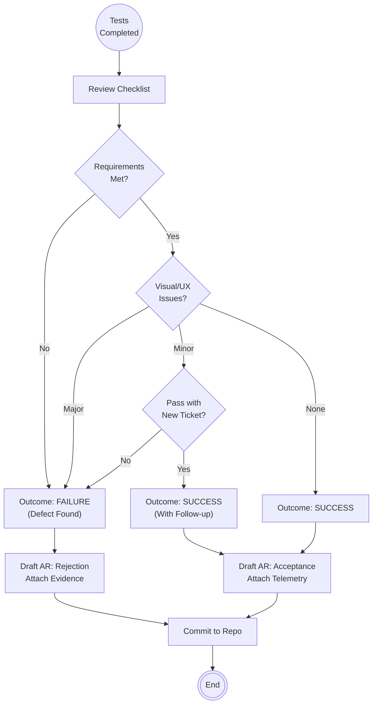

<!--
  Mandelbrot Explorer
  Copyright (C) 2026 Marcin Kaim

  This program is free software: you can redistribute it and/or modify
  it under the terms of the GNU General Public License as published by
  the Free Software Foundation, either version 3 of the License, or
  (at your option) any later version.

  This program is distributed in the hope that it will be useful,
  but WITHOUT ANY WARRANTY; without even the implied warranty of
  MERCHANTABILITY or FITNESS FOR A PARTICULAR PURPOSE.  See the
  GNU General Public License for more details.

  You should have received a copy of the GNU General Public License
  along with this program.  If not, see <https://www.gnu.org/licenses/>.
-->

# Scenario: VALIDATION_REPORTING

## 1. Objective

**Certify the Product.**

The objective of this scenario is to formalize the results of the Dynamic Validation phase. The Tester synthesizes the checklist results and collected evidence into a binding **Validation Report**. This artifact triggers the final state transition of a Task: either to `DONE` (Release Candidate) or back to `ACTIVE` (Rework required).

## 2. Process Flow Diagram



## 3. Triggers

This routine is invoked immediately after `DYNAMIC_VALIDATION` concludes.

## 4. Input Data

* **Test Results:** The filled-out checklist from the Test Plan (Pass/Fail status for each item).
* **Evidence:** Screenshots, Logs (`stdout.txt`), and Performance Metrics (`nvidia-smi` snapshots).
* **Template:** `template-action-report.md`.

## 5. Execution Algorithm

### Step 1: Verdict Determination

* **Action:** Review the gathered data against the acceptance criteria.
* **Rules:**
    * **Functional Failure:** Any crash, freeze, or incorrect calculation  **FAILURE**.
    * **Performance Failure:** Frame time > Limit, or GPU Usage == 0%  **FAILURE**.
    * **Visual Glitch (Major):** Obscures functionality  **FAILURE**.
    * **Visual Glitch (Minor):** 1px misalignment, slight color deviation  **Judgment Call** (Can pass if a new Bug Ticket is created immediately).


### Step 2: Drafting the Report

* **Location:** `docs/control/05-tasks/02-reports/{Task-ID}/`.
* **Naming:** `AR-[Seq]-tester-validation.md`.
* **Metadata Header:**
    * `Author`: Tester.
    * `Outcome`: `SUCCESS` or `FAILURE`.
    * `Next Phase`:
        * If `SUCCESS`  `DONE`.
        * If `FAILURE`  `ACTIVE`.


### Step 3: Compiling the Evidence

* **Constraint:** "Show, Don't Tell".
* **Content:**
    * **The Checklist:** Copy the markdown checklist. Check boxes using `[x]`.
    * **Screenshots:** If `SUCCESS`, show the working feature. If `FAILURE`, show the bug.
    * **Telemetry:**
        ```text
        +-----------------------------------------------------------------------------+
        | NVIDIA-SMI 535.183.01   Driver Version: 535.183.01   CUDA Version: 12.2     |
        |...                                                                          |
        | 0  NVIDIA RTX 3500 Ada ...  On   | 00000000:01:00.0 Off |                  N/A |
        | 30%   55C    P8    12W /  80W |    452MiB / 12282MiB |      0%      Default |
        +-----------------------------------------------------------------------------+

        ```
        (This proves the RTX 3500 was active during the test).


### Step 4: Publication & Signaling

* **Action:** Commit the report to the repository.
* **Signal:** The Manager Agent observes this file to update the Global Roadmap.

## 6. Output Artifacts

* **The Validation Report:** The final sign-off document for the task iteration.

## 7. Exception Handling

### Case A: The "Works, but..." (UX Friction)

* **Condition:** The feature works mathematically, but the UX is clunky (e.g., zoom is too sensitive).
* **Action:**
    1. Mark Outcome as **SUCCESS**.
    2. Open a **New Task** (Improvement) in the backlog.
    3. Note in the report: "Passed functional reqs. UX sensitivity issue tracked in `task-XX`."


### Case B: Environment Flakiness during Reporting

* **Condition:** The test passed, but while generating the report, the system updated and now it fails.
* **Action:**
    1. Do not lie.
    2. Re-run the test.
    3. If it fails now, report **FAILURE**. Regression is regression, regardless of the cause.
